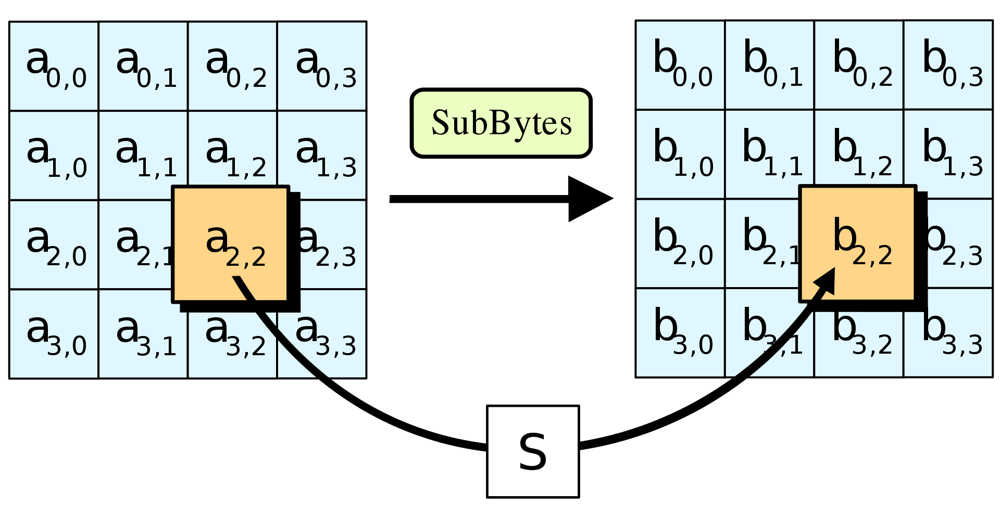

## 分组密码

### AES

#### AES 参数

* 块大小128

* 密钥大小为128、192和256位

* 每个密钥大小为10、12或14轮加密

以 AES-128 为例。

AES是一个替换置换网络（不是Feistel网络）。


首先将消息安排在元素为8比特的4 × 4矩阵中，向下填充，然后向右填充。

#### AES 操作

* 字节代换（S盒）：对每个字节进行独立操作。这就给出了 AES 的非线性和混淆。
* 字节排列：行移位
* 列操作：列混淆

> 行移位和列混淆提供了 AES 中的扩散。

* 轮密钥加

这 10 轮加密过程之前会有一次密钥加法（因此，总共有 11 次密钥加法）。最后一轮稍有不同：没有列混淆操作。


##### AES 的字节操作

AES 是一种面向字节的加密算法。被各轮操作处理的 128 位“状态”（state）被视为 16 个字节，并排列成一个矩阵的形式：


* $\oplus$ ：按位异或

* $\otimes$ ：$F_{2^8}$上的乘法 $F_2[x]$

  如：

  $$
  \begin{aligned}
    0x53 \otimes 0xCA / (x^8 + x^4 + x^3 + x + 1) &= (x^6+x^4+x+1)(x^7+x^6+x^3+x)/(x^8 + x^4 + x^3 + x + 1) \\
    &= 0x01
  \end{aligned}
  $$

##### 字节代换



矩阵中的各字节透过一个8位的[S-box](https://en.wikipedia.org/wiki/Rijndael_S-box#Forward_S-box)进行转换。这个步骤提供了非线性的变换能力。

##### 行移位


##### 列混淆


将每一列分别混合，通过与矩阵相乘来实现：


每一列的四个字节透过[线性变换](https://zh.wikipedia.org/wiki/线性变换)互相结合。每一列的四个元素分别当作 $1,x,x_2,x_3$ 的系数，合并即为 $GF(2^8)$ 中的一个多项式，接着将此多项式和一个固定的多项式 $c(x)=3x^3+x^2+x+2$ 在模 $x^4+1$ 下相乘。

##### 轮密钥加


#### 密钥调度

派生轮密钥 $K_i$ 的方法如下：将 $K$ 分成四个字 $W_0,W_1,W_2$ 和 $W_3$ 各32位。

```c++
for i:=1 to 10 do
    T:=W[4i-1]<<<8
    T:=SubBytes(T)
    T:=T⊕RC[i]
    W[4i]:= W[4i−4]⊕T
    W[4i+1]:= W[4i−3]⊕W[4i]
    W[4i+2]:= W[4i−2]⊕W[4i+1]
    W[4i+3]:= W[4i−1]⊕W[4i+2]
end
```

* 轮密钥$K_i = W_{4i}, W_{4i+1}, W_{4i+2}, W_{4i+3}$

* 常数 $RC_i=0x\space rc_i000000$
  
  $rc_i=x^{i-1}\bmod x^8 + x^4 + x^3 + x + 1$

### SM4

#### 核心定位与特性

SM4全称为“SM4分组密码算法”，由国家密码管理局发布，标准号为GB/T 32907-2016，其核心定位是满足国内商用领域的数据加密需求，替代部分国外算法实现自主可控。

其核心特性主要包括三点：

1. **分组与密钥长度固定**：分组长度和密钥长度均为128位，这一设计平衡了安全性和计算效率，能有效抵御常见的密码分析攻击。
2. **对称密码体制**：加密和解密使用相同的密钥，操作流程对称，便于硬件和软件快速实现，适合对处理速度有要求的场景。
3. **国产化自主可控**：算法设计完全由国内团队完成，无外部后门风险，符合国家信息安全战略，是政务、金融等关键领域的首选加密算法之一。

#### 算法原理

SM4算法是一种典型的迭代型分组密码，基于“代换-置换网络（Substitution-Permutation Network，SPN）”结构设计，其核心设计思路是通过多轮次的非线性代换（混淆）和线性置换（扩散）操作，将明文数据转化为完全不可识别的密文，同时保证加密与解密过程的对称性和高效性。整体加密流程可细分为**初始变换**、**32轮轮函数迭代**、**反初始变换**三个核心阶段，而支撑整个流程的关键还有**密钥扩展算法**，用于生成每轮迭代所需的轮密钥。

1. **轮函数迭代（核心执行环节）**：轮函数是SM4加密的核心模块，32轮迭代过程采用完全相同的结构，每轮操作都实现一次“混淆-扩散”循环。具体流程如下：首先，将128位明文分组划分为4个32位的字，记为X₀、X₁、X₂、X₃（后续每轮迭代的输入均为4个32位字）；然后，取后3个输入字Xᵢ₊₁、Xᵢ₊₂、Xᵢ₊₃与本轮轮密钥rkᵢ进行“轮函数F”运算，得到的结果再与第一个输入字Xᵢ进行异或（XOR）操作，生成新的字Xᵢ₊₄，同时将Xᵢ₊₁、Xᵢ₊₂、Xᵢ₊₃、Xᵢ₊₄作为下一轮迭代的输入，依次循环32轮。其中“轮函数F”包含四个关键子操作，按顺序执行： 

2. **字节代换（S盒变换）**：这是实现非线性混淆的核心步骤。将32位输入字拆分为4个8位字节，每个字节通过SM4专用S盒进行查表替换。S盒是基于GF(2⁸)有限域上的逆运算和仿射变换设计的，具有良好的非线性特性和抗差分攻击能力，能有效打破输入与输出之间的线性关联； 

3. **行移位（字节移位）**：对S盒输出的4个字节进行循环移位操作，第一个字节不移位，第二个字节左移1个字节，第三个字节左移2个字节，第四个字节左移3个字节。该操作通过位置置换实现字节级别的扩散，使单个字节的变化影响到多个位置； 3. **列混合（线性变换）**：对行移位后的4个字节进行线性变换，通过固定的线性矩阵与字节向量相乘（基于GF(2)域运算），将单个字节的信息扩散到整个32位字中，进一步增强数据的扩散效果； 

4. **轮密钥加（异或操作）**：将列混合后的32位结果与本轮轮密钥rkᵢ进行异或运算，实现密钥信息与明文信息的深度融合。32轮迭代完成后，得到的4个32位字X₃₂、X₃₃、X₃₄、X₃₅需经过“反初始变换”（即将4个字按X₃₅、X₃₄、X₃₃、X₃₂的顺序重组为128位数据），最终得到128位密文。

   

- **密钥扩展算法（轮密钥生成）**：SM4的加密和解密均依赖128位主密钥，但每轮轮函数需要独立的32位轮密钥，因此需通过密钥扩展算法将128位主密钥扩展为32个32位轮密钥（rk₀至rk₃₁）。具体步骤为：首先将128位主密钥拆分为4个32位字MK₀、MK₁、MK₂、MK₃，与4个固定的32位系统参数FK₀、FK₁、FK₂、FK₃分别异或，得到密钥扩展的初始输入字K₀、K₁、K₂、K₃；然后采用与轮函数类似的迭代方式生成后续密钥字，对于第i轮（i从0到31），取前4个密钥字中的后3个（Kᵢ₊₁、Kᵢ₊₂、Kᵢ₊₃）与一个固定的32位常量CKᵢ进行“密钥扩展函数G”运算，结果再与第一个密钥字Kᵢ异或，得到新的密钥字Kᵢ₊₄，其中Kᵢ₊₄即为第i轮的轮密钥rkᵢ。“密钥扩展函数G”同样包含S盒字节代换和线性变换操作，确保生成的轮密钥具有良好的随机性和独立性，避免因主密钥泄露或轮密钥关联性导致的安全风险。

- **解密原理（对称结构设计）**：SM4的解密过程与加密过程在结构上完全对称，核心优势是无需重新生成解密密钥，仅需将加密时使用的32个轮密钥按逆序（即rk₃₁至rk₀）使用即可。这是因为轮函数具有“可逆性”——字节代换的逆操作可通过S盒的逆表实现，行移位的逆操作是反向循环移位，列混合的逆操作可通过逆线性矩阵实现，而异或操作本身是自逆的。因此，解密时只需将密文作为输入，按加密的反向流程执行32轮迭代（使用逆序轮密钥），再经过初始变换（与加密的反初始变换对称），即可还原出原始明文，这种对称设计极大简化了算法的硬件和软件实现复杂度。

#### 与国际算法对比

目前国际上主流的分组密码算法是AES，SM4与AES在设计和应用上既有共性，也存在显著差异，具体对比如下：

| 对比维度      | SM4算法                                    | AES算法                                    |
| ------------- | ------------------------------------------ | ------------------------------------------ |
| 设计主体      | 中国国家密码管理局                         | 美国国家标准与技术研究院（NIST）           |
| 分组/密钥长度 | 均固定为128位                              | 分组128位，密钥支持128/192/256位           |
| 算法结构      | 32轮SPN结构                                | 10/12/14轮SPN结构（依密钥长度）            |
| 安全性        | 抵御差分、线性等攻击，无公开安全漏洞       | 国际公认安全，应用广泛，经过长期验证       |
| 适用场景      | 国内政务、金融、物联网等需国产化合规的领域 | 全球通用，适用于互联网、跨境业务等国际场景 |

#### 

### 分组密码的工作模式

一个好的分组密码模式应该具有以下属性：

1. 安全性（保密性）：相同的明文不应产生相同的密文；明文中的相同块不应该产生相同的密文块。
2. 安全性（完整性）：应该有防止删除或插入块的保护。
3. 恢复：密文传输错误应该只影响包含错误的块。
4. 效率：它应该是有效率的（例如，可并行）。

#### PKCS#7填充

PKCS#7 标准规定，填充字节的值等于填充的长度（如填充 6 字节则每个字节为`0x06`），解密时通过最后一个字节的值即可知道需要去除多少填充。

#### ECB

电码本模式

* 加密：

  

* 解密：

  

- 特点：
    * 加密可以并行计算。
    * 明文块$m_i$的改变只会影响到密文块$c_i$的改变。
    * 密文块在传输中单个比特出错只会影响到该块的解密。
    * 相同的明文产生相同的密文，容易暴露出明文的数据格式，不能抵抗替换攻击（篡改）。因此该模式适合加密短数据，如一个会话密钥。

#### CBC

密码分组链接模式

* 加密：

  

​	$C_i=E_k(P_i \oplus C_{i-1} )$

​	$C_0=IV$


* 解密：

  

​	$P_i=D_k(C_i) \oplus C_{i-1}$

​	$C_0=IV$

- 特点：
    - 每次加密都应该随机选择IV。
    * 必须将IV与密文一起存储，否则无法解密。因此，IV是*随机的*，但不是*秘密的*。
    * 由于密文包含IV，因此它比明文长一个块。所以在长度上有小扩展。
    * 相同的明文块产生的密文块可能不同，
    * 明文块$m_i$发生改变将引起后面所有密文块发生改变。
    * 密文块$c_i$依赖于明文块$m_i$以及所有前面的明文块。
    * 密文块$c_i$中单个比特出错会影响后续至多两个密文块$c_i$和$c_{i+1}$的解密，具有有限的错误传播特性。
  

#### CFB
//
密码反馈模式

- 加密

- 解密

- 特点：
    - 

#### OFB
//
输出反馈模式

- 加密

- 解密

- 特点：
    - 

#### CTR

计数器模式

* 加密：

  

* 解密：

  

- 特点：
    - 计数器$CTR_1$, ..., $CTR_t$互不相同，这样可以保证相同的明文块产生不同的密文块。
    - 由于加密计数器时不需要明文，因此可以预处理来提高加密速度。
    - 可以并行计算。
### 加密系统的安全性

#### 加密系统安全性的定义

1. 给定一个密文，攻击者（在没有密钥的情况下）绝对无法获得明文。
    * 不安全，如 3DES 会泄露明文块是否相同。
2. 给定一个密文，攻击者可以仅通过 $N$ 单位的工作量获得明文。
    * 不安全，攻击者可能足够幸运猜出密钥。

3. 给定一个密文，攻击者要么通过消耗 $N$ 单位的工作量获得明文，要么以最多 $\frac{1}{M}$ 的概率猜测明文或密钥。
   * 不安全，攻击者可以获得关于明文内容的统计信息。

4. 给定一个密文，攻击者不能推测明文的**任何信息**，除非消耗 $N$ 单位的工作量获得明文，或者以最多 $\frac{1}{M}$ 的概率猜测明文或密钥。

#### IND-CPA

基于选择明文攻击的不可区分性

1. 挑战者：$k$ --> 攻击者
2. 攻击者：$m_0,m_1$ --> 挑战者
3. 挑战者：$b\in \{0,1\}$, $Enc_k(m_b)$ -->攻击者
4. 攻击者：$b'$ --> 挑战者
5. if $b'=b$，挑战者获胜

#### IND-CCA

基于选择密文攻击的不可区分性

1. 挑战者：生成$(pk,sk)$, $pk$ --> 攻击者
2. 攻击者：若干个$c$ --> 挑战者
3. 挑战者：$m=Dec(sk,c)$ --> 攻击者
4. 攻击者：$m_0,m_1$ --> 挑战者
5. 挑战者：$b\in \{0,1\}$, $c^* = Enc(pk, m_b)$ --> 攻击者
6. 攻击者可以再次进行解密查询，但不能查询挑战密文 $c^*$ 的解密结果。
7. 攻击者：$b^*$ --> 挑战者
8. if $b'=b$，挑战者获胜
9.  如果在多次实验中，无论攻击者的策略如何，其成功概率都不能显著超过随机猜测（50%），则加密方案是 **IND-CCA 安全的**，。

## Hash 函数

### Hash 函数的性质
1. 输入任意长
2. 输出固定长
3. 对任意给定的$x$，计算$h(x)$比较容易
4. 单向性：对任意给定的 Hash 值 $z$，找到满足 $h(x)= z$ 的 $x$ 在计算上是不可行的 
5. 抗弱碰撞性：已知 $x$，找到 $y(y \ne x)$ 满足 $h(y)=h(x)$ 在计算上是不可行的
6. 抗强碰撞性：找到任意两个不同的数据 $x$、$y$ 满足 $h(y)=h(x)$ 在计算上是不可行的

### 迭代型 Hash 函数的一般结构

Merkle-Damgård 结构：
函数的输入 $m$ 被分为 $L$ 个分组 $m_0, m_1, ..., m_{L-1}$，每个分组的长度为 b 比特。如果最后一个分组的长度不够，需要填充。最后一个分组还包括消息 $m$ 的长度值。CV 是链接变量（Chaining Variable）。MD4、MD5、SHA-1、SHA-2 都使用此结构，只有 SHA-3 使用完全不同的海绵结构。

$$
\begin{cases}
CV_0 = IV \\
CV_i = f(CV{i-1},m_{i-1}), 1 \le i \le L\\
h(m) = CV_L
\end{cases}
$$

### MD5

- 算法：输入为任意长度的消息，对消息以 512 bit 长的分组为单位进行处理，输出为 128 bit 的 Hash 值。
- 填充消息：填充消息使其 $长度 \equiv 448 \bmod 512$，由一个 $1$ 和若干个 $0$ 组成。
- 填充长度：用 64 bit 表示填充前消息的长度，最低有效字节在前即小端序））。如果 $消息长度 > 2^{64}$，则以 $2^{64}$ 为模数取模。
- 初始化 MD 缓冲区。
- 处理消息。
- 输出。

### SHA
- 算法：输入为长度小于 $2^{64}$ 的消息，对消息以 512 bit 长的分组为单位进行处理，输出为 160 bit 的 Hash 值。
- 填充消息：同 MD5。
- 填充长度：同 MD5，最高有效字节在前（即大端序）。
- ...

### SM3

SM3是我国自主设计的密码杂凑算法（哈希算法），于2010年与SM2一同成为国家密码标准（GB/T 32905-2016），是我国商用密码体系的核心组成部分之一。其核心功能是将任意长度的输入数据（明文）映射为固定长度（256位）的输出数据（哈希值/摘要），具有抗碰撞性、抗原像性等关键安全特性，广泛配合SM2等算法使用，为数字签名、数据完整性校验、密钥派生等场景提供基础安全保障。

SM3是一种迭代型密码杂凑算法，基于Merkle-Damgård结构设计，通过固定的运算步骤将任意长度的输入消息压缩为256位的哈希值。与国际通用的SHA-256算法相比，SM3在运算逻辑、轮函数设计上存在差异，但安全强度等效，且更适配我国密码体系的协同需求，常与SM2（签名/加密）、SM4（对称加密）协同工作，形成完整的密码保障链条。

#### 算法核心原理与运算流程

SM3的运算流程遵循迭代型杂凑算法的通用框架，分为“消息预处理”和“迭代压缩”两大阶段，最终通过“输出变换”得到256位哈希值。每个阶段的具体步骤如下：

##### 第一阶段：消息预处理

预处理的目的是将任意长度的原始消息转换为固定长度的消息块序列，为后续迭代压缩做准备，包括“消息填充”和“消息分组”两个步骤。

###### 消息填充

填充的核心要求是使消息总长度满足“对512取余等于448”，具体步骤：

1. 在原始消息M后添加一个“1”比特，即二进制的“1”；
2. 在“1”后添加若干个“0”比特，添加的数量k满足“(原始消息长度 + 1 + k) mod 512 = 448”，k的取值范围为0≤k≤511；
3. 在填充的“0”后添加一个64位的整数，该整数表示原始消息M的长度（单位：比特），若原始消息长度超过2^64比特，仅取低64位。

示例：若原始消息长度为1比特（值为“0”），则填充过程为：添加“1”→添加446个“0”→添加64位长度值“0x0000000000000001”，最终填充后消息长度为512比特（448+64）。

###### 消息分组

将填充后的消息按512比特（64字节）为一个分组，划分为若干个消息块M_0, M_1, ..., M_{n-1}，若填充后消息长度为L，则n = L / 512，且n≥1。每个消息块将作为后续迭代压缩的输入单元。

##### 第二阶段：迭代压缩

迭代压缩是SM3的核心环节，以512位消息块为单位，通过“压缩函数f”对初始哈希值进行迭代更新，最终得到中间哈希值。该阶段涉及“初始值设置”“消息扩展”“压缩函数运算”三个关键步骤。

###### 初始哈希值设置

SM3的初始哈希值（IV）为8个32位寄存器，其初始值由标准规定，采用十六进制表示为：

IV = (A, B, C, D, E, F, G, H) = (0x7380166F, 0x4914B2B9, 0x172442D7, 0xDA8A0600, 0xA96F30BC, 0x163138AA, 0xE38DEE4D, 0xB0FB0E4E)

这8个初始值是经过安全设计的固定常量，确保迭代压缩的初始状态具有随机性和安全性。

###### 消息扩展

为增强算法的抗攻击能力，SM3将每个512位消息块M_i扩展为132个32位字W_0, W_1, ..., W_131，分为“前68个字扩展”和“后64个字扩展”两部分：

1. **前68个字生成（W_0至W_67）**：将512位消息块M_i按32位为单位划分为16个字W_0至W_15；对于W_j（16≤j≤67），通过以下公式计算：W_j = P1(W_{j-16} ⊕ W_{j-9} ⊕ (W_{j-3} << 15)) ⊕ (W_{j-13} << 7) ⊕ W_{j-6}。其中P1为置换函数，定义为P1(X) = X ⊕ (X << 15) ⊕ (X << 23)，“⊕”为异或运算，“<<”为左移运算。
2. **后64个字生成（W_68至W_131）**：对于W_j（68≤j≤131），通过公式W_j = W_{j-64} ⊕ W_{j-68}计算，用于后续压缩函数的轮运算。

###### 压缩函数运算

压缩函数f以初始哈希值（或上一轮迭代的输出哈希值）和扩展后的132个字为输入，经过64轮迭代运算更新8个32位寄存器的值，得到本轮迭代的输出哈希值。具体步骤：

1. 将上一轮输出的哈希值（初始轮为IV）赋值给8个临时寄存器：a=A, b=B, c=C, d=D, e=E, f=F, g=G, h=H；
2. 进行64轮轮运算，每一轮以W_j和W_{j+68}（j从0到63）为输入，通过轮函数更新a-h的值。轮函数的核心是“布尔函数”和“置换运算”，其中布尔函数根据轮数不同分为FF_j和GG_j：        当0≤j≤15时，FF_j(X,Y,Z) = X ⊕ Y ⊕ Z，GG_j(X,Y,Z) = X ⊕ Y ⊕ Z；
3. 当16≤j≤63时，FF_j(X,Y,Z) = (X ∧ Y) ∨ (X ∧ Z) ∨ (Y ∧ Z)，GG_j(X,Y,Z) = (X ∧ Y) ∨ (¬X ∧ Z)；
4. 64轮运算结束后，将a-h分别与初始的A-H进行异或，得到本轮迭代的输出哈希值（A', B', C', D', E', F', G', H'），该值将作为下一个消息块的输入哈希值。

##### 第三阶段：输出变换

当所有消息块均完成迭代压缩后，最后一轮的输出哈希值（8个32位寄存器值）直接拼接为256位的最终哈希值，即SM3(M) = A' || B' || C' || D' || E' || F' || G' || H'（“||”表示字节拼接）。

#### SM3与国际算法的核心差异

作为256位安全级别的杂凑算法，SM3常与国际通用的SHA-256对比，两者在安全强度上等效，但在设计细节和应用场景上存在显著差异，具体对比如下：

| 对比维度   | SM3                                                      | SHA-256                                                     |
| :--------- | :------------------------------------------------------- | :---------------------------------------------------------- |
| 标准归属   | 中国国家密码标准（GB/T 32905-2016）                      | 美国NIST标准（FIPS 180-4）                                  |
| 消息扩展   | 将512位块扩展为132个32位字，含P1置换函数，扩展逻辑更复杂 | 将512位块扩展为64个32位字，无额外置换函数，扩展逻辑相对简洁 |
| 轮函数设计 | 64轮运算，布尔函数FF_j、GG_j分两段设计，含P0/P1置换      | 64轮运算，布尔函数Ch、Maj固定，无额外置换                   |
| 初始哈希值 | 自定义8个32位常量（如0x7380166F等）                      | 基于平方根和对数的小数部分取整（如0x6A09E667等）            |
| 应用场景   | 我国金融、政务、军工等关键领域强制合规，配合SM2/SM4使用  | 国际通用场景（如TLS、区块链、软件签名等）                   |
| 实现效率   | 软件实现效率略低于SHA-256，硬件实现适配性强              | 通用CPU上软件实现效率较高，优化成熟                         |

### 基于分组密码的 Hash 函数

//

### Hash 函数的分析方法
#### 生日攻击


#### 长度扩展攻击

SHA-1, SHA-256 和 SHA-512 容易受到长度扩展攻击：

给定 $h(x)$，可以为某个 $x'$ 构造 $h(x||x')$，而无需知道 $x$。这是通过定义 $x' = padding(x)||length(x)||...$ 来实现的。

虽然这不是一种破坏性的攻击，但它阻止了使用 Hash 函数产生 MACs 的某种方式（见后文）。

#### 差分分析


## MACs

Hash 函数可以用来保证消息的完整性。然而，单独的 Hash 函数不足以保证消息的真实性（即消息来自特定来源的事实）。如果仅使用 Hash 函数，攻击者可以修改消息并重新计算 Hash 。

为了保证真实性，我们在被散列的消息中包含一个秘密密钥。然后我们知道只有持有密钥的真实方才能计算散列。在散列中包含一个秘密密钥被称为“产生消息认证码”。

### HMAC

$$
HMAC_k(m) = h((k \oplus opad) || h((k \oplus ipad)||m))
$$
密钥 $k$ 被填充为散列函数的块大小，$ipad$ 和 $opad$ 是该块大小的常数

### CBC-MAC

使用CBC操作模式进行分组密码。

### PMAC

Hash 函数、HMAC 和 CBC-MAC 不能并行化，PMAC解决了这个问题。

- 两个密钥 $K$ 和 $L$。
- 函数 $P(K, i)= K * x^i$ 在 $\text{F}_{2n}$中


### MAC 的安全性

设 $m$ 为一条消息。那么 $\text{MAC}_k(n)$ 有时被称为 $m$ 的标签。

若一个攻击者（未掌握密钥）无法生成其之前未曾见过的有效（消息，标签）对，则该 MAC 函数是安全的。

这被称为***抗存在性伪造安全***。

#### MAC 游戏
挑战者与攻击者之间的消息认证码（MAC）游戏定义如下：

- 攻击者进行一些计算，过程中可能向挑战者提供消息 $m_1, \dots, m_n$。
- 挑战者向攻击者返回 $t_1, \dots, t_n$，这些是对消息 $m_1, \dots, m_n$ 生成消息认证码的结果。
- 攻击者进行更多计算，然后向挑战者提供一对 $(m, t)$，该对不等于任何 $(m_1, t_1), \dots, (m_n, t_n)$ 对。
- 如果 $t$ 是通过对 $m$ 生成消息认证码得到的，挑战者输出1；否则返回0。
- 如果挑战者输出1，攻击者赢得该MAC游戏。

若没有攻击者能以不可忽略的概率赢得上述 MAC 游戏，则称该消息认证码（MAC）是*安全* 的。此处的概率与前文一致，均为密钥长度的函数。

#### 示例

CBC-MAC 是不安全的（除非添加限制条件）。

假设攻击者拥有消息-标签对 $(m, t)$ 和 $(m', t')$。那么他可以伪造第三个消息-标签对 $(m'', t'')$：

我们假设 $m'$ 的长度超过一个分组；即 $m' = m'_1 \parallel m'_2 \parallel \dots \parallel m'_p$ 。//

令 $m'' = m \parallel (m'_1 \oplus t) \parallel m'_2 \parallel \dots \parallel m'_p$，且 $t'' = t'$。

验证 $(m'', t'')$ 是一个有效的消息-标签对。

- 假设 CBC-MAC 仅用于固定长度的消息。如果使用的分组密码是安全分组密码，则 CBC-MAC 是安全的 MAC。另一种实现方法是在消息中预先添加长度。
- 如果使用的哈希函数是安全的，那么 HMAC 就是安全的 MAC。
- 如果使用的分组密码是安全的，则 PMAC 是安全的 MAC。


## 认证加密


##


## 公钥密码

### RSA

#### 公钥与私钥

1. 随意选择两个大素数 $p$ 和 $q$, $p\ne q$, 计算 $N=pq$.

2. 根据欧拉函数，求得 $r=\phi(N)=\phi(p) \times \phi(q)=(p-1)(q-1)$

3. 选择 $e<r$，($gcd(e,r)=1$). 求得 $d, ed=1 \bmod r$

4. 销毁 $p,q$

5. $pk=(N,e)$

   $sk=(N,d)$

#### 加密

将消息 $m$ 转换为小于 $N$ 的非负整数 $n$：

$c=n^e\bmod N$

#### 解密

$n=c^d\bmod N$

###### 原理

$c^d=n^{ed}\bmod N$

已知 $ed=1 \bmod r$，即 $ed=1+h\phi(N)$，那么有

$n^{ed}=n^{1+h\phi(N)}=n\cdot (n^{\phi(N)})^h$

若 $n$ 与 $N$ 互素，则由欧拉定理得：

$n^{ed}=n\cdot (n^{\phi(N)})^h=n(1)^h=n\bmod N$

若 $n$ 与 $N$ 不互素，则不失一般性考虑 $n=pt$, 以及 $ed-1=k(q-1)$，得：

$n^{ed}=(pt)^{ed}=0=pt=n\bmod p$

$n^{ed}=n^{ed-1}n=n^{k(q-1)}n=(n^{q-1})^kn=1^kn=n\bmod q$

故 $n^{ed}=n \bmod N$ 得证

#### IND-CPA安全结构：使用RSA加密


$c=m \oplus H(r)\space||\space RSA.ENC_{sk}(r)$

#### 可以直接使用 RSA 实现单向安全吗

* 不。带有小消息和小 $e$ 的 RSA 函数不安全：

  * 假设 $p, q > 10^6$. 因此$N = pq > 10^{12}$
  * 假设 $e = 7$ 和消息 $m = 5$
  * 计算 $c = m^e \bmod N = 5^7 \bmod N = 78125\bmod N = 78125$

* 密文很小，所以 $mod N$ 没有效果。$c = m^e$

  * $\log_{10}c= e\log_{10}\implies m=10^{\frac{\log C}{e}}$
  * 在我们的例子中 $log 78125 = 4.892$。因此 $\frac{log c}{e} = 0:698$

  * 恢复 $m=10^{0.698} = 5$

#### 填充:PKCS ##1v1:5

* 随机填充

​	$y = 0x00||0x02||r||0x00||m$

​	$c = y^e\bmod N$

* SSL的解密后处理（1998年前）

  $y = c^d mod N$
  检查 $y$ 的前两个字节。如果 $y \ne 0x00||0x02||... $ 输出 **Bad Format** ，否则输出 $m$

###### 选择密文攻击：Bleichenbacher 攻击

* 得到一个密文 $c = y^e mod N$。
  * 计算 $c' = c\cdot s^e\bmod N = (y\cdot s)^e\bmod N$，取合适的 $s$。

* 检查服务器是否接受 $c'$。

* $N$ 是一个 $k$ 字节数

  * $2.2^{8(k−2)}\leq ys \bmod N < 3.2^{8(k−2)}$ 和

  * $2.2^{8(k−2)}\leq y \bmod N < 3.2^{8(k−2)}$
  * $y \bmod N < 3.2^{8(k−2)}/s$

* 以 $s' > s$ 重复上述过程。

* 通过二分查找选择 $s$。

#### IND-CCA安全结构：最优非对称加密（OAEP）


$s=(m||0...0)\oplus G(r)$

$t=r\oplus H(s)$

$c=RSA.ENC_{pk}(s||t)$

### ElGamal


### Rabin


### ECC


### SM2

SM2是我国自主设计的椭圆曲线公钥密码算法，于2010年正式成为国家密码标准（GB/T 32918-2016），可全面替代RSA算法，在安全性、性能和资源占用上均有显著优势，广泛应用于数字签名、密钥交换和数据加密等场景。

#### 算法核心定义

SM2算法的基础是椭圆曲线密码学（ECC），其核心是在特定有限域上的椭圆曲线群中进行运算，具体定义包含以下关键要素：

1. **有限域选择**：采用素数域$\mathbb{F}_P$，其中$p$是一个满足特定安全要求的大素数，标准中规定$p$的比特长度可为256位、384位等，256位是目前最常用的安全级别。
2. **椭圆曲线方程**：在$\mathbb{F}_p$上定义的椭圆曲线方程为$y^2 = x^3 + ax + b \pmod{p}$，其中$a$和$b$是满足$4a^3 + 27b^2 \not\equiv 0 \pmod{p}$的域元素，以确保曲线无奇异点。
3. **基点与阶**：存在一个特定的基点$G=(x_G, y_G)$，它是椭圆曲线上的一个生成元，其阶为$n$（即$nG=O$，$O$为无穷远点）。$n$必须是一个大素数，且满足$n > 2^{191}$和$n \not \mid p^k - 1$（$1 \leq k \leq 20$），以抵抗离散对数相关攻击。
4. **密钥对生成**：
    1. 私钥：随机选择一个整数$d$，满足$1 < d < n - 1$；
    2. 公钥：通过椭圆曲线点乘计算$P = dG$，$P$是椭圆曲线上的一个点，与私钥$d$一一对应。

#### 核心运算流程

SM2算法的三大核心应用场景（数字签名、密钥交换、数据加密）对应不同的运算流程，具体如下：

##### 数字签名与验证

用于确认数据完整性和发送者身份，是SM2最常用的功能，流程分为“签名生成”和“签名验证”两步。

###### 签名生成

1. 对待签名数据$M$进行哈希处理，使用SM3密码杂凑算法计算摘要$e = SM3(M)$；
2. 随机选择一个整数$k$，满足$1 < k < n - 1$，计算点$K = kG = (x_K, y_K)$；
3. 计算$r = (e + x_K) \pmod{n}$，若$r = 0$或$r + k = n$，则重新选择$k$；
4. 计算$s = [(1 + d)^{-1} \cdot (k - r \cdot d)] \pmod{n}$，若$s = 0$，则重新选择$k$；
5. 最终签名结果为$(r, s)$，与数据$M$一同发送给接收方。

###### 签名验证

1. 接收数据$M$和签名$(r, s)$，先验证$r$和$s$是否满足$1 \leq r, s \leq n - 1$，不满足则验证失败；
2. 计算摘要$e = SM3(M$)，并计算$t = (r + s) \pmod{n}$，若$t = $0，则验证失败；
3. 计算点$K' = sG + t$，若$K' = $O（无穷远点），则验证失败；
4. 设$K' = (x_{K'}, y_{K'})$，计算$r' = (e + x_{K'}) \pmod{n}$；
5. 若$r' = r$，则签名验证通过；否则验证失败。

##### 密钥交换

用于通信双方在不安全信道上协商出一个共享会话密钥，流程需双方交互两次，以A（发起方）和B（响应方）为例：

1. **初始化**：A拥有私钥$d_A$和公钥$P_A = d_AG $；B拥有私钥$d_B$和公钥$P_B = d_BG $，双方已互相获取对方公钥。
2. **第一轮交互（A→B）**：
    1. A随机选整数$k_A$（$1 < k_A < n - 1$），计算$K_A = k_AG $，并将$K_A$发送给B；
3. **第二轮交互（B→A）**：
    1. B随机选整数$k_B$（$1 < k_B < n - 1 $），计算$K_B = k_BG $；
    2. B计算共享密钥材料$S_B = d_B \cdot (K_A + [h]P_A)$，其中$h$是椭圆曲线的余因子（标准中$h=1$）；
    3. B将$K_B$发送给A，并对$K_A$、$K_B$等信息生成验证数据；
4. **A计算共享密钥**：
    1. A验证B发送的验证数据，确认B身份；
    2. A计算共享密钥材料$S_A = d_A \cdot (K_B + [h]P_B)$；
5. **密钥派生**：A和B分别对$S_A$、$S_B$进行相同的密钥派生函数（KDF）处理，得到相同的会话密钥$SK$，用于后续数据加密。

##### 数据加密与解密

用于对敏感数据进行加密，确保仅指定接收方能解密，流程如下：

###### 加密

1. 获取接收方公钥$P$，验证$P$是否为椭圆曲线上的有效点且$nP = O$，无效则终止；
2. 随机选整数$k$（$1 < k < n - $），计算$C_1 = k$G（作为解密所需的“临时公钥”）；
3. 计算点$S = k$，若$S = O$，则重新选择$k$；设$S = (x_S, y_S$，将$x_s$和$y_y$拼接为字节串$xSyS$；
4. 对明文$M$进行分组（若需），使用对称密码算法（如SM4），以$KDF(xSyS, len)$生成的密钥加密$M$，得到密文$C_2$；
5. 计算$C_3 = SM3(xSyS || M)$（用于验证明文完整性）；
6. 最终密文为$C = C_1 || C_2 || C_3$，发送给接收方。

###### 解密

1. 接收密文$c$，拆分出$C_1$、$C_2$、$C_3$，验证$C_1$是否为椭圆曲线上的有效点，无效则解密失败；
2. 用私钥$d$计算点$S = dC_1$，若$S = O$，则解密失败；设$S = (x_S, y_S)$，拼接为$xSyS$；
3. 生成对称密钥$K = KDF(xSyS, len)$，解密$C_2$得到明文$M$；
4. 计算$C_3' = SM3(xSyS || M')$，若$C_3' = C_3$，则明文有效，$M'$为原始明文；否则解密失败。


## 数字签名

### RSA


### Elgamal


### DSA


## PKI

## PEM

## 密码协议

### 密钥分配


### 密钥协商

### 

### 秘密共享


### 身份识别


### 零知识证明


## 密码学工具

### openssl