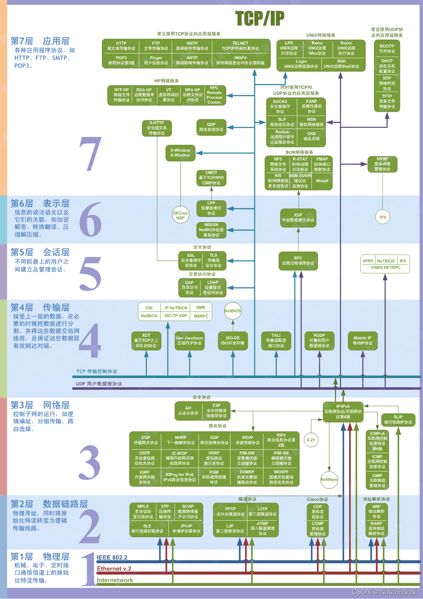

## 总览


## 应用层

为应用软件提供网络服务，如文件传输和电子邮件。

### FTP

#### 概述

FTP（File Transfer Protocol，文件传输协议）是 TCP/IP 协议族中的应用层协议，主要用于在不同主机（如本地电脑和远程服务器）之间传输文件。

它的核心价值在于：

- 实现跨设备、跨网络的文件双向传输（上传 / 下载）。

- 支持文件管理操作（如创建目录、删除文件、重命名）。

- 早期广泛用于网站搭建（上传网页文件到服务器）、数据备份等场景。

#### 工作原理

FTP 与 HTTP 等单连接协议不同，它在通信时会建立两个独立的 TCP 连接，分别负责 “指令传输” 和 “数据传输”，这是理解其工作机制的关键。

| 连接类型     | 作用                                      | 连接时机                     | 端口特点                    |
| ------------ | ----------------------------------------- | ---------------------------- | --------------------------- |
| **控制连接** | 传输指令（如登录、上传 / 下载命令、退出） | 客户端发起连接后立即建立     | 服务器端固定使用**21 端口** |
| **数据连接** | 传输实际文件或目录列表数据                | 执行具体操作（如下载）时建立 | 端口不固定，分两种模式      |

##### 连接模式

FTP 的核心复杂度在于数据连接的建立方式，两种模式的区别在于 “谁主动发起数据连接”，这会影响防火墙的配置（比如被动模式更易穿透防火墙）。

1. **主动模式（Active Mode）**

- 流程：客户端先通过 21 端口建立控制连接，然后客户端告知服务器 “我用 XX 端口接收数据”；服务器收到指令后，主动从自身的 20 端口向客户端的 XX 端口发起数据连接。

- 缺点：如果客户端在防火墙后，服务器主动发起的连接可能被防火墙拦截，导致数据传输失败。

1. **被动模式（Passive Mode，常用）**

- 流程：客户端建立控制连接后，发送 “PASV” 指令请求被动模式；服务器收到后，开放一个随机的 “数据端口”（如 1024-65535 之间），并将该端口号通过控制连接告知客户端；客户端再主动向服务器的这个随机端口发起数据连接。

- 优点：数据连接由客户端主动发起，符合防火墙 “允许内部主动向外连接” 的默认策略，因此在互联网环境中（如家用宽带、公司内网）更常用。

#### 登录与认证方式

FTP 服务器通常需要认证才能访问，主要有两种认证模式：

1. **匿名登录（Anonymous FTP）**

- 无需账号密码，客户端登录时用户名填 “anonymous”，密码可填任意内容（如邮箱地址）。

- 用途：常用于公开文件下载（如开源软件镜像站，如[ftp.gnu.org](https://ftp.gnu.org)），一般只开放下载权限，禁止上传。

1. **用户认证（User Authentication）**

- 需要服务器端预先创建的账号和密码（如网站管理员的服务器账号）。

- 权限：根据账号配置，可拥有上传、下载、修改目录等完整权限，安全性更高，用于私有的文件传输（如网站文件管理）。

#### 优缺点

##### 优点

- 兼容性强：几乎所有操作系统（Windows、Linux、macOS）和服务器都原生支持 FTP，无需额外安装复杂软件。

- 功能明确：专注于文件传输，支持断点续传（部分客户端支持）、批量传输等实用功能。

##### 缺点

- 安全性差：FTP 传输的所有数据（包括账号密码、文件内容）都是**明文传输**，没有加密，容易被中间人截取和破解。

- 效率较低：双连接模式在高并发场景下（如大量客户端同时传输），服务器端口管理复杂度高，性能不如现代协议（如 SFTP）。

- 防火墙适配复杂：主动模式易被拦截，需要额外配置防火墙规则。

#### 安全性升级

由于 FTP 的安全缺陷，现在更多场景会用更安全的协议替代，核心是解决 “明文传输” 问题：

| 替代协议 | 核心特点                                      | 端口                      | 适用场景                   |
| -------- | --------------------------------------------- | ------------------------- | -------------------------- |
| **SFTP** | 基于 SSH 协议加密（所有数据加密传输），单连接 | 服务器 22 端口            | 服务器文件管理（如 Linux） |
| **FTPS** | 在 FTP 基础上添加 SSL/TLS 加密（类似 HTTPS）  | 控制端口 21，数据端口随机 | 需要兼容旧 FTP 系统时      |

#### FTP 工具

除了命令行工具（如ftp命令、curl的ftp://协议），日常使用中更多用图形化工具，操作更直观：

- Windows：FileZilla、CuteFTP、FlashFXP

- Linux/macOS：FileZilla（跨平台）、Transmit（macOS 专用）

- 命令行：ftp命令（基础）、lftp（增强版，支持断点续传、批量操作）


### RPC

#### 概述

RPC（Remote Procedure Call，远程过程调用）是一种允许程序调用另一个地址空间（通常是远程服务器）中的函数或过程的协议，其核心目标是让远程调用像本地调用一样简单，隐藏网络通信的复杂性。

RPC 本质上是**分布式系统中的通信协议**，属于应用层协议，建立在 TCP 和 UDP 等传输层协议之上。

它的核心价值在于：

- 屏蔽远程通信细节：开发者无需手动处理网络连接、数据编码 / 解码、错误处理等，直接调用远程函数即可。

- 简化分布式系统开发：让多个服务（如微服务架构中的订单服务、用户服务）像本地程序一样协作。

- 跨语言 / 跨平台：支持不同编程语言（如 Java 调用 Python 服务）、不同操作系统间的通信。

#### 工作原理

RPC 的工作流程可概括为 “本地函数调用的远程映射”，关键是通过一系列中间层将远程调用伪装成本地调用。以下是完整流程：

1. **客户端发起调用**

客户端调用本地的 “存根函数”（Stub，也叫客户端代理），传入参数（如userService.getUserId("张三")）。这个存根函数的签名与远程服务的函数完全一致，让开发者感觉在调用本地函数。

2. **参数序列化**

客户端 Stub 将函数名（如getUserId）和参数（如"张三"）转换为可在网络中传输的二进制数据（序列化），常见格式有 Protobuf、JSON、XML 等。序列化的目的是将内存中的对象转换为字节流，便于网络传输。

3. **网络传输**

客户端 Stub 通过 TCP/UDP 等传输协议，将序列化后的数据发送到远程服务器的指定端口。

4. **服务器接收与反序列化**

服务器端的 “监听进程” 接收数据后，交给服务器端 Stub（也叫服务端代理）。服务器 Stub 将二进制数据还原为函数名和参数（反序列化）。

5. **执行远程函数**

服务器 Stub 根据函数名找到对应的本地函数（如getUserId的实现），执行该函数并获取返回结果（如1001）。

6. **返回结果序列化与传输**

服务器 Stub 将返回结果序列化，通过网络发送回客户端。

7. **客户端接收结果**

客户端 Stub 接收数据并反序列化，将结果返回给客户端程序，完成一次 RPC 调用。

#### 核心组件

- **Stub（存根 / 代理）**

- 客户端 Stub：模拟远程函数的本地接口，负责参数序列化、发起网络请求、接收结果并反序列化。

- 服务器 Stub：监听网络请求，负责反序列化参数、调用本地函数、序列化返回结果。

（可以理解为 RPC 的 “翻译官”，处理本地与远程的 “语言转换”）

- **序列化 / 反序列化器**

将内存中的数据结构（如对象、数组）与网络传输的字节流相互转换。性能优秀的序列化协议（如 Protobuf）是高性能 RPC 的关键。

- **传输层协议**

负责实际的数据传输，多数 RPC 框架基于 TCP（可靠传输，适合数据量大、要求不丢包的场景），少数轻量级 RPC 使用 UDP（速度快，适合实时性要求高的场景，如游戏）。

- **服务注册与发现（可选，分布式场景必备）**

在微服务等分布式系统中，服务器地址可能动态变化（如服务扩容、故障迁移），需要通过注册中心（如 ZooKeeper、Nacos）管理服务地址，客户端通过注册中心查询服务器地址。

#### 常见 RPC 框架及应用场景

1. **主流框架**

- 跨语言：gRPC（基于 HTTP/2 和 Protobuf，Google 开源）、Thrift（Facebook 开源，支持多语言）。

- 单一语言：Java 的 Dubbo、Spring Cloud OpenFeign；Python 的 Pyro；Go 的 gRPC-Go。

1. **典型应用场景**

- 微服务架构：如电商系统中，订单服务调用支付服务、库存服务的接口。

- 分布式计算：如大数据框架（Hadoop）中，主节点调用从节点的计算函数。

- 跨语言协作：如后端 Java 服务调用 AI 团队的 Python 模型接口。

#### 优缺点

##### 优点

- 开发效率高：屏蔽网络细节，开发者专注业务逻辑。

- 性能优秀：相比 HTTP 等通用协议，序列化和传输效率更高。

- 适合内部服务通信：接口定义清晰，易于维护。

##### 缺点

- 耦合度较高：客户端与服务器的接口定义需严格一致，修改接口可能导致双方都需更新。

- 通用性较差：不同 RPC 框架通常不兼容，不如 HTTP 通用（如无法直接通过浏览器调用）。

- 调试复杂：远程调用的错误排查（如网络问题、序列化问题）比本地调用更复杂。

### HTTP

#### 概述

HTTP（HyperText Transfer Protocol，超文本传输协议）是 TCP/IP 协议族中**应用层**的标准化协议。

- **TCP/IP 四层模型定位**：属于应用层，完全依赖传输层的**TCP 协议**（而非 UDP），通过 TCP 的 “三次握手” 建立可靠连接、“四次挥手” 关闭连接，保障数据传输的顺序性和完整性（无丢包、无乱序）。

- **默认端口**：IANA（互联网号码分配局）分配的公认端口为**80**，客户端发起 HTTP 请求时，默认向服务器的 80 端口建立连接（若未指定其他端口）。

#### 核心特性

##### 1. 无状态（Stateless）

- **定义**：HTTP 协议本身不记录客户端的历史交互状态，每次请求都是独立的 “一次性交易”—— 服务器不会记得上一次客户端请求的内容（如是否登录、浏览过哪些页面）。

- **原因**：简化服务器设计，降低服务器内存开销，让服务器能同时处理更多客户端请求。

- **状态补充方案**：通过应用层机制实现状态管理，常见方式包括：

- Cookie：服务器通过Set-Cookie响应头向客户端发送小段数据，客户端后续请求会自动携带Cookie请求头，用于标识用户身份（如登录状态）；

- Session：服务器为每个客户端创建独立的 “会话”，将状态存储在服务器内存 / 数据库中，客户端通过 Cookie 携带 SessionID 关联会话；

- Token：客户端登录后获取服务器颁发的 Token（如 JWT），后续请求通过Authorization头携带 Token，服务器验证 Token 即可识别用户，无需存储会话（适合分布式系统）。

##### 2. 无连接（Connectionless，早期特性，HTTP/1.1 后优化）

- **HTTP/1.0 的无连接**：每次请求完成后立即关闭 TCP 连接，下次请求需重新建立连接（三次握手），导致频繁连接建立 / 关闭的开销，效率低。

- **HTTP/1.1 的长连接优化**：通过Connection: keep-alive请求头启用 “长连接”，TCP 连接在一次请求完成后不立即关闭，可复用该连接处理后续多次请求（默认保持 15-60 秒，具体由服务器配置），大幅减少连接开销。

- **注意**：“无连接” 并非指没有 TCP 连接，而是早期协议设计中 “一次请求对应一次连接” 的特性，HTTP/1.1 后已通过长连接弱化这一限制。

##### 3. 可扩展（Extensible）

- **协议头字段扩展**：HTTP 允许自定义请求头和响应头（如X-Requested-With: XMLHttpRequest标识 AJAX 请求，X-Custom-Info: user123传递自定义业务信息），只要客户端和服务器约定好字段含义即可正常交互。

- **方法与状态码扩展**：IANA 定期更新 HTTP 方法和状态码列表，同时允许私有方法（如PROPFIND用于 WebDAV）和自定义状态码（如451 Unavailable For Legal Reasons用于法律限制场景）。

##### 4. 媒体无关（Media-Independent）

- HTTP 不限制传输的数据格式，通过Content-Type头字段标识数据类型（如text/html表示 HTML 文档、image/jpeg表示 JPEG 图片、application/json表示 JSON 数据），客户端根据该字段解析数据，实现 “传输任意媒体类型” 的灵活性。

#### 工作流程

1. **建立 TCP 连接**：客户端通过 Socket 接口向服务器的 80 端口发起 TCP 三次握手，建立可靠连接（如浏览器访问[www.baidu.com](http://www.baidu.com)，先与百度服务器的 80 端口建立 TCP 连接）。

2. **发送 HTTP 请求**：客户端构造 HTTP 请求报文（包含请求行、请求头、请求体），通过 TCP 连接发送给服务器。

   - 示例请求行：GET /index.html HTTP/1.1（请求方法为 GET，目标资源为/index.html，协议版本为 HTTP/1.1）；

   - 常见请求头：Host: [www.baidu.com](http://www.baidu.com)（指定目标服务器域名）、User-Agent: Chrome/[120.0.0.0](http://120.0.0.0)（标识客户端浏览器信息）、Accept: text/html（表示客户端可接收 HTML 格式数据）。

3. **服务器处理与响应**：服务器接收 HTTP 请求后，解析请求内容（如判断请求的资源是否存在、用户是否有权限访问），构造 HTTP 响应报文（包含状态行、响应头、响应体）返回给客户端。

   * 示例状态行：HTTP/1.1 200 OK（协议版本为 HTTP/1.1，状态码 200 表示请求成功）；

   - 常见响应头：Content-Type: text/html; charset=utf-8（指定响应体为 HTML 格式，编码为 UTF-8）、Content-Length: 1024（指定响应体大小为 1024 字节）；

   - 响应体：即实际的资源数据（如 HTML 代码、图片二进制数据）。

4. **关闭 TCP 连接**：若使用 HTTP/1.0（早期版本），数据传输完成后会立即发起 TCP 四次挥手关闭连接；若使用 HTTP/1.1 或 HTTP/2，支持 “长连接”（通过Connection: keep-alive请求头启用），可复用 TCP 连接处理多次请求，减少连接建立开销。

#### 报文结构

HTTP 通信的核心是 “请求 - 响应” 模式，客户端发送**请求报文**，服务器返回**响应报文**，两者结构相似，均由 “起始行 + 头部字段 + 空行 + 消息体” 四部分组成。

##### 1. HTTP 请求报文结构

```
<请求行>  ## 核心：方法、URL、协议版本
<请求头1>: <值1>  ## 键值对形式，多个头部字段
<请求头2>: <值2>
...
<空行>  ## 头部与消息体的分隔，必须存在（即使无消息体）
<消息体>  ## 可选，如POST请求的表单数据、JSON参数
```

- **请求行（Request Line）**：格式为[方法] [URL] [协议版本]，示例：

  - GET /index.html HTTP/1.1：使用 GET 方法请求/index.html资源，协议版本为 HTTP/1.1；

  - POST /api/login HTTP/1.1：使用 POST 方法请求/api/login接口，协议版本为 HTTP/1.1。

- **常见请求头**：

  - Host：指定目标服务器的域名和端口（如Host: [www.baidu.com](http://www.baidu.com)，HTTP/1.1 强制要求包含，用于虚拟主机配置）；

  - User-Agent：标识客户端身份（如浏览器型号、操作系统，示例：User-Agent: Mozilla/5.0 (Windows NT 10.0; Win64; x64) Chrome/[120.0.0.0](http://120.0.0.0)）；

  - Accept：客户端可接收的数据类型（如Accept: text/html,application/json表示优先接收 HTML 和 JSON）；

  - Content-Type：请求消息体的数据类型（如Content-Type: application/x-www-form-urlencoded表示表单数据，application/json表示 JSON 数据）；

  - Content-Length：请求消息体的长度（字节数，如Content-Length: 50）；

  - Cookie：携带客户端存储的 Cookie 数据（如Cookie: sessionid=abc123; username=test）。

- **消息体（Request Body）**：仅在需要向服务器发送数据时存在（如 POST/PUT 请求），常见形式包括：

  - 表单数据：username=test&password=123456（对应Content-Type: application/x-www-form-urlencoded）；

  - JSON 数据：{"username":"test","password":"123456"}（对应Content-Type: application/json）；

  - 文件数据：二进制流（对应Content-Type: multipart/form-data，用于文件上传）。

##### 2. HTTP 响应报文结构

```
<状态行>  ## 核心：协议版本、状态码、状态描述
<响应头1>: <值1>
<响应头2>: <值2>
...
<空行>  ## 头部与消息体的分隔
<消息体>  ## 可选，如HTML页面、JSON响应数据
```

- **状态行（Status Line）**：格式为[协议版本] [状态码] [状态描述]，示例：

  - HTTP/1.1 200 OK：协议版本 HTTP/1.1，状态码 200（请求成功），描述为 OK；

  - HTTP/1.1 404 Not Found：状态码 404（资源未找到），描述为 Not Found。

- **常见响应头**：

  - Content-Type：响应消息体的数据类型（如Content-Type: text/html; charset=utf-8，指定 HTML 编码为 UTF-8）；

  - Content-Length：响应消息体的长度（如Content-Length: 2048）；

  - Set-Cookie：服务器向客户端设置 Cookie（如Set-Cookie: sessionid=abc123; Path=/; Max-Age=3600，表示 Cookie 有效期 1 小时）；

  - Cache-Control：控制客户端缓存策略（如Cache-Control: max-age=86400，表示资源可缓存 1 天）；

  - Location：用于重定向，指定新的资源地址（如Location: https://www.baidu.com，配合 3xx 状态码使用）；

  - Server：标识服务器软件（如Server: Nginx/1.20.0）。

- **消息体（Response Body）**：服务器返回的实际数据，如 HTML 文档（<!DOCTYPE html><html>...</html>）、JSON 数据（{"code":200,"data":{"id":123}}）、图片二进制流等。

#### 请求方法（Method）

请求方法定义了客户端对服务器资源的 “操作意图”，IANA 标准化的常用方法如下，部分方法具有 “安全性” 和 “幂等性” 特性（重要概念）：

- **安全性**：方法执行后不会修改服务器资源（如 GET 仅查询数据，不会新增 / 删除资源）；

- **幂等性**：多次执行相同请求，结果与一次执行一致（如 PUT 重复提交不会产生不同结果，POST 重复提交可能重复创建资源）。

| 方法    | 核心作用                                    | 安全性 | 幂等性 | 常见场景                                |
| ------- | ------------------------------------------- | ------ | ------ | --------------------------------------- |
| GET     | 查询服务器资源（如获取网页、API 数据）      | 是     | 是     | 浏览器地址栏访问、AJAX 查询数据         |
| POST    | 向服务器提交数据，创建新资源（如表单提交）  | 否     | 否     | 登录表单提交、上传文件、创建订单        |
| PUT     | 向服务器提交数据，全量更新资源              | 否     | 是     | API 更新用户信息（如PUT /api/user/123） |
| DELETE  | 删除服务器资源                              | 否     | 是     | API 删除订单（如DELETE /api/order/456） |
| HEAD    | 与 GET 类似，但仅返回响应头，无响应体       | 是     | 是     | 检查资源是否存在、获取资源大小          |
| OPTIONS | 询问服务器支持的请求方法和头字段            | 是     | 是     | CORS 跨域预检请求（如前端跨域调用 API） |
| PATCH   | 部分更新服务器资源（区别于 PUT 的全量更新） | 否     | 否     | API 修改用户昵称（仅传昵称字段）        |

##### 关键注意事项：

- GET 请求的参数通过 URL 传递（如/api/user?name=test&age=18），有长度限制（依赖浏览器 / 服务器，通常 2-8KB），且参数会暴露在 URL 中（不安全，不适合传递密码）；

- POST 请求的参数通过消息体传递，无长度限制（由服务器配置决定），适合传递敏感数据或大量数据（但需注意：HTTP 本身明文传输，敏感数据仍需 HTTPS 加密）。

#### 状态码（Status Code）

状态码是服务器对请求结果的 “状态标识”，由 3 位数字组成，分为 5 大类（首位数字表示类别），覆盖 “成功、重定向、客户端错误、服务器错误” 等所有场景：

##### 1. 1xx 信息性状态码（Informational）

- 表示服务器已接收请求，正在处理，临时响应，无需客户端后续操作；

- 常见：100 Continue（客户端发送大请求前，服务器确认可继续接收，如文件上传）。

##### 2. 2xx 成功状态码（Successful）

- 表示请求已成功处理；

- 常见：

  - 200 OK：请求成功，响应体包含数据（最常用）；

  - 204 No Content：请求成功，但无响应体（如 DELETE 删除成功）；

  - 206 Partial Content：部分内容请求成功（如断点续传，客户端通过Range头请求部分资源）。

##### 3. 3xx 重定向状态码（Redirection）

- 表示请求需要客户端进一步操作（如跳转至新地址）；

- 常见：

  - 301 Moved Permanently：永久重定向（如旧域名跳转至新域名，搜索引擎会更新索引）；

  - 302 Found：临时重定向（如登录后跳转至首页，搜索引擎不更新索引）；

  - 304 Not Modified：资源未修改，客户端可使用本地缓存（配合If-Modified-Since等缓存头使用，减少带宽消耗）；

  - 307 Temporary Redirect：临时重定向，与 302 类似，但严格保持请求方法（如 POST 请求跳转后仍用 POST）。

##### 4. 4xx 客户端错误状态码（Client Error）

- 表示请求存在错误（如资源不存在、权限不足），责任在客户端；

- 常见：

  - 400 Bad Request：请求参数错误（如 JSON 格式错误、表单字段缺失）；

  - 401 Unauthorized：未授权（如未登录访问需要登录的资源，响应头通常包含WWW-Authenticate提示认证方式）；

  - 403 Forbidden：权限不足（如已登录，但无访问管理员页面的权限）；

  - 404 Not Found：请求的资源不存在（如 URL 拼写错误、资源已删除）；

  - 405 Method Not Allowed：请求方法不被允许（如服务器不支持 POST 请求该 URL）；

  - 408 Request Timeout：请求超时（服务器等待客户端请求过久）；
  - 413 Payload Too Large：请求消息体过大（如文件上传超过服务器限制）；

  - 414 URI Too Long：请求 URL 过长（如 GET 参数过多）。

##### 5. 5xx 服务器错误状态码（Server Error）

- 表示服务器处理请求时发生错误，责任在服务器；

- 常见：

  - 500 Internal Server Error：服务器内部错误（如代码 bug、数据库连接失败，最常见的服务器错误）；

  - 502 Bad Gateway：网关错误（如 Nginx 反向代理时，后端服务器无响应）；

  - 503 Service Unavailable：服务不可用（如服务器维护、过载，通常会包含Retry-After头提示重试时间）；

  - 504 Gateway Timeout：网关超时（如 Nginx 反向代理时，后端服务器处理超时）；

  - 505 HTTP Version Not Supported：服务器不支持请求的 HTTP 版本（如客户端用 HTTP/2，服务器仅支持 HTTP/1.1）。

#### 版本

HTTP 协议不断迭代优化，核心目标是 “提升性能、降低延迟、增强功能”，各版本关键特性如下：

##### 1. HTTP/1.0（1996 年，首次标准化）

- 核心改进：

- 支持多种请求方法（GET、POST、HEAD）；

- 引入请求头和响应头（如Host、Content-Type）；

- 支持多种媒体类型（不再仅 HTML，如图片、文本）；

- 引入状态码（如 200、404）；

- 缺陷：默认短连接（每次请求关闭 TCP 连接），性能低；无长连接、缓存控制机制不完善。

##### 2. HTTP/1.1（1999 年，目前应用最广泛的版本）

- 核心改进（解决 HTTP/1.0 痛点）：

- 支持长连接（Connection: keep-alive），复用 TCP 连接；

- 支持管道化（Pipelining）：同一 TCP 连接中，客户端可连续发送多个请求（无需等待前一个响应），但服务器仍需按顺序返回响应（“队头阻塞” 问题仍存在）；

- 支持虚拟主机（通过Host头，一台服务器可部署多个域名）；

- 完善缓存控制（如Cache-Control、ETag、If-None-Match）；

- 支持分块传输编码（Transfer-Encoding: chunked，无需提前知道消息体长度，适合动态生成的内容）；

- 新增请求方法（PUT、DELETE、OPTIONS、PATCH）和状态码（如 409 Conflict、509 Bandwidth Limit Exceeded）；

- 现状：仍占据互联网流量的主流（约 70%），兼容性好，所有服务器和客户端均支持。

##### 3. HTTP/2（2015 年，基于 SPDY 协议优化）

- 核心改进（解决 HTTP/1.1 性能瓶颈）：

- 二进制帧（Binary Framing）：将 HTTP 报文拆分为二进制帧（Header Frame、Data Frame），而非文本格式，解析效率更高；

- 多路复用（Multiplexing）：同一 TCP 连接中，可并发传输多个请求的帧（每个请求分配独立的 “流 ID”），服务器可乱序返回响应，彻底解决 HTTP/1.1 的 “队头阻塞” 问题（HTTP/1.1 管道化需按顺序响应，一个请求阻塞会影响后续所有请求）；

- 头部压缩（Header Compression）：使用 HPACK 算法压缩请求头和响应头，减少重复头字段（如User-Agent、Cookie在多次请求中重复出现）的传输量，降低带宽消耗；

- 服务器推送（Server Push）：服务器可主动向客户端推送关联资源（如客户端请求index.html时，服务器主动推送style.css和script.js），避免客户端二次请求，减少延迟；

- 流量控制（Flow Control）：基于流的流量控制机制，客户端可告知服务器每个流的接收窗口大小，避免服务器发送数据过快导致客户端缓存溢出；

- 现状：逐步普及，主流浏览器（Chrome、Firefox、Safari）和服务器（Nginx、Apache）均支持，适合对性能要求较高的场景（如电商网站、短视频平台）。

##### 4. HTTP/3（2022 年，基于 QUIC 协议）

- 核心改进（解决 HTTP/2 的 TCP 层痛点）：

- 基于 QUIC 协议（而非 TCP）：QUIC 是基于 UDP 的可靠传输协议，解决 TCP 的 “队头阻塞” 问题（TCP 连接级阻塞，一个流丢包会导致整个连接的所有流阻塞；QUIC 是流级阻塞，仅丢包的流受影响）；

- 0-RTT 连接建立：客户端首次连接服务器需 1-RTT（Round-Trip Time，往返时间），后续重连可实现 0-RTT（直接复用之前的会话信息），大幅减少连接建立延迟（尤其适合移动网络，RTT 波动大）；

- 内置 TLS 加密：HTTP/3 强制要求 TLS 1.3 加密，无需像 HTTP/2 那样额外配置 TLS，安全性更高；

- 连接迁移（Connection Migration）：支持客户端 IP 或端口变化时（如手机从 Wi-Fi 切换到 4G），无需重新建立连接，保持会话连续性（TCP 连接依赖 IP 和端口，切换后需重新握手）；

- 现状：处于推广阶段，主流浏览器（Chrome、Edge）已支持，服务器（Nginx 1.25+、Cloudflare）逐步适配，未来将成为高性能场景的主流协议（如实时通信、云游戏）。

#### 缓存机制（核心性能优化手段）

HTTP 缓存是客户端（如浏览器）或中间节点（如 CDN、代理服务器）存储服务器资源的副本，后续请求可直接使用副本，无需重复从服务器获取，核心目标是 “减少网络传输、降低服务器压力、提升访问速度”。缓存机制通过请求头和响应头协同控制，分为 “强缓存” 和 “协商缓存” 两类。

##### 1. 强缓存（优先生效，无需请求服务器）

- **定义**：客户端判断缓存是否过期，若未过期则直接使用缓存（不发送 HTTP 请求到服务器）；若已过期则进入协商缓存流程。

- **控制头字段**：

- Cache-Control（HTTP/1.1，优先级高于Expires）：

  - max-age=<seconds>：缓存有效期（秒），如Cache-Control: max-age=86400表示缓存 1 天（86400 秒）；

  - no-store：禁止缓存（客户端和中间节点均不存储资源，每次需从服务器获取）；

  - no-cache：不使用强缓存，直接进入协商缓存（需与服务器确认资源是否更新）；

  - public：允许中间节点（如 CDN）缓存资源；

  - private：仅允许客户端（如浏览器）缓存资源，禁止中间节点缓存（如包含用户隐私的页面）。

- Expires（HTTP/1.0，已被Cache-Control替代）：
  - 格式为 GMT 时间（如Expires: Wed, 15 Nov 2025 12:00:00 GMT），表示缓存到该时间点过期；
    - 缺陷：依赖客户端本地时间，若客户端时间与服务器时间不一致，会导致缓存判断错误。

- **生效流程**：
  1. 客户端首次请求资源，服务器返回Cache-Control: max-age=86400；
  2. 客户端存储资源和缓存规则，记录缓存时间；
  3. 后续请求时，计算 “当前时间 - 缓存时间”，若小于max-age则直接使用缓存（浏览器控制台显示 “200 OK (from disk cache)” 或 “from memory cache”）。

##### 2. 协商缓存（强缓存失效后，需与服务器确认）

- **定义**：客户端发送请求到服务器，携带缓存标识，服务器判断资源是否更新：

  - 若未更新：返回304 Not Modified，无响应体，客户端使用缓存；

  - 若已更新：返回200 OK和新资源，客户端更新缓存。

- **控制头字段（缓存标识）**：

- 方案 1：Last-Modified（响应头） + If-Modified-Since（请求头）：

  - 服务器返回资源最后修改时间（如Last-Modified: Tue, 14 Oct 2025 10:00:00 GMT）；

  - 客户端后续请求携带If-Modified-Since: Tue, 14 Oct 2025 10:00:00 GMT，服务器对比资源当前修改时间与该值：

    - 若资源未修改（当前时间 ≤ If-Modified-Since）：返回 304；

    - 若已修改：返回 200 和新资源，更新Last-Modified。

  - 缺陷：无法识别资源的 “微小修改”（如文件内容未变，仅修改文件名或权限），且修改时间精度为秒（若资源 1 秒内多次修改，无法区分）。

- 方案 2：ETag（响应头） + If-None-Match（请求头）（优先级高于方案 1）：

  - 服务器根据资源内容生成唯一标识（如哈希值，如ETag: "5f8d72a3"），资源内容变化则ETag变化；

  - 客户端后续请求携带If-None-Match: "5f8d72a3"，服务器对比当前资源的ETag与该值：

    - 若一致（资源未变）：返回 304；

    - 若不一致（资源已变）：返回 200 和新资源，更新ETag。

  - 优势：基于内容判断，精度更高，可识别微小修改和秒内多次修改。

##### 3. 缓存位置（客户端缓存的存储层级）

浏览器缓存资源时，会根据资源类型和使用频率存储在不同位置，优先级从高到低为：

- **Memory Cache（内存缓存）**：存储在浏览器内存中，速度最快，关闭浏览器后缓存失效；适合频繁使用的资源（如当前页面的 JS、CSS）。

- **Disk Cache（磁盘缓存）**：存储在本地磁盘中，速度较慢但持久化（关闭浏览器后仍存在）；适合不频繁使用或体积较大的资源（如图片、字体文件）。

- **Service Worker Cache（服务工作线程缓存）**：由前端代码控制的缓存（如 PWA 应用），可自定义缓存策略，支持离线访问。

#### 常见问题与解决方案

##### 1. 跨域资源共享（CORS，Cross-Origin Resource Sharing）

- **问题定义**：浏览器的 “同源策略” 限制（协议、域名、端口三者一致为同源），禁止客户端从 A 域名请求 B 域名的资源（如前端部署在http://localhost:3000，请求后端http://localhost:8080的 API 时触发跨域）。

- **解决方案（服务器配置响应头）**：

  - Access-Control-Allow-Origin: <origin>：允许的请求源（如*表示允许所有源，http://localhost:3000表示仅允许该源）；

  - Access-Control-Allow-Methods: GET, POST, PUT, DELETE：允许的请求方法；

  - Access-Control-Allow-Headers: Content-Type, Authorization：允许的请求头；

  - Access-Control-Allow-Credentials: true：允许客户端携带 Cookie（此时Access-Control-Allow-Origin不能为*，需指定具体源）；

  - 预检请求（Preflight）：对于非简单请求（如 POST 请求的Content-Type: application/json、带自定义头的请求），浏览器会先发送OPTIONS请求验证服务器是否允许跨域，服务器需正常响应OPTIONS请求。

##### 2. 请求阻塞与性能优化

- **问题表现**：HTTP/1.1 的 “队头阻塞”（管道化场景）、TCP 连接数限制（浏览器默认对同一域名最多建立 6-8 个 TCP 连接），导致大量请求排队等待，页面加载缓慢。

- **解决方案**：

  - 升级协议：使用 HTTP/2 或 HTTP/3，通过多路复用和 QUIC 协议解决队头阻塞；

  - 资源合并与压缩：合并 JS/CSS 文件（减少请求数），使用 Gzip/Brotli 压缩资源（减少传输体积）；

  - 域名分片（Domain Sharding）：将资源分散到多个子域名（如[img1.example.com](http://img1.example.com)、[img2.example.com](http://img2.example.com)），突破同一域名的 TCP 连接数限制；

  - 使用 CDN：将静态资源（图片、JS、CSS）部署到 CDN，就近节点分发，减少网络延迟。

##### 3. 数据安全性问题（HTTP 明文传输）

- **问题定义**：HTTP 传输的所有数据（请求头、请求体、响应体）均为明文，可被中间人抓包窃取（如账号密码、支付信息）或篡改。

- **解决方案**：

  - 升级 HTTPS：通过 SSL/TLS 加密层实现数据加密、身份认证和完整性校验（详见此前 HTTPS 相关内容）；

  - 敏感数据额外加密：即使使用 HTTPS，客户端可对敏感数据（如密码）在本地进行对称加密（如 AES），再通过 HTTPS 传输，双重保障。

##### 4. 会话状态管理（无状态协议的补充）

- **问题定义**：HTTP 无状态特性导致服务器无法识别连续请求的客户端身份（如登录后无法维持登录状态）。

- **解决方案（前文已提及，补充细节）**：

  - Cookie：优点是无需前端处理（浏览器自动携带），缺点是存在 CSRF 攻击风险（跨站请求伪造，需配合SameSite属性防护，如Set-Cookie: sessionid=abc123; SameSite=Lax，限制 Cookie 仅在同源请求中携带）；

  - Token：优点是无 CSRF 风险（需前端手动在请求头携带），支持分布式系统（服务器无需存储会话），缺点是需处理 Token 过期（如刷新 Token 机制）；

  - Session：优点是安全性高（状态存储在服务器），缺点是分布式场景下需会话共享（如使用 Redis 存储 Session）。

#### 相关工具（实践辅助）

##### 1. 抓包工具（查看 HTTP 报文）

- **Fiddler/Charles**：拦截客户端与服务器的 HTTP/HTTPS 请求，查看请求报文、响应报文、缓存状态，支持修改请求参数和响应数据（用于调试接口）。

- **浏览器开发者工具（Network 面板）**：实时查看当前页面的所有 HTTP 请求，显示请求方法、状态码、响应时间、缓存类型等信息（Chrome 按 F12 打开，切换到 Network 面板）。

##### 2. 接口测试工具

- **Postman/Insomnia**：可视化发送 HTTP 请求（支持 GET、POST、PUT 等所有方法），设置请求头、请求体，验证响应结果，适合后端 API 测试。

- **curl（命令行工具）**：通过命令行发送 HTTP 请求（如curl -X GET "http://api.example.com/user?id=123"），适合服务器端或自动化脚本场景。

##### 3. 服务器软件（部署 HTTP 服务）

- **Nginx/Apache**：主流 Web 服务器，支持静态资源托管、反向代理（转发请求到后端服务）、HTTPS 配置、缓存控制等。

- **Node.js（Express/Koa）**：前端开发者常用的轻量级 HTTP 服务器，通过代码快速实现 HTTP 接口（如app.get('/api/user', (req, res) => res.send({ id: 123 }))）。

### HTTPS

#### 概述

HTTPS（HyperText Transfer Protocol Secure，超文本传输安全协议）并非独立协议，而是 **HTTP 协议与 SSL/TLS 协议的结合体**—— 通过在 HTTP 和 TCP 之间添加 SSL/TLS 加密层，解决 HTTP 的安全缺陷，如今已成为电商、金融、社交等敏感场景的强制协议（默认端口 443）。

#### 工作原理

SSL（Secure Sockets Layer，安全套接层）由 Netscape 于 1994 年推出，后被 IETF（互联网工程任务组）标准化并更名为 TLS（Transport Layer Security，传输层安全协议），目前主流版本为 TLS 1.2 和 TLS 1.3。其核心作用包括三点：

- **身份认证**：通过数字证书验证服务器身份（由权威 CA 机构颁发，如 Symantec、Let's Encrypt），确保客户端连接的是真实目标服务器，而非钓鱼站点。

- **数据加密**：采用 “非对称加密 + 对称加密” 混合模式，对传输的数据进行加密：

1. 握手阶段：使用非对称加密（如 RSA、ECC）交换 “对称加密密钥”（如 AES 密钥），避免密钥在传输中被窃取；
2. 数据传输阶段：使用对称加密（速度远快于非对称加密）对 HTTP 请求 / 响应数据进行加密，保障数据隐私。

- **数据完整性校验**：通过哈希算法（如 SHA-256）生成数据的 “消息摘要”，若传输过程中数据被篡改，客户端可通过校验摘要发现异常。

#### 工作流程

HTTPS 的工作流程比 HTTP 多了 “SSL/TLS 握手” 环节，整体分为四步：

1. **TCP 三次握手**：与 HTTP 一致，客户端先与服务器的 443 端口建立 TCP 连接。
2. **SSL/TLS 握手（核心安全环节）**：

- 步骤 1：客户端发送 “客户端问候”（包含支持的 TLS 版本、加密套件列表、随机数 Random1）；

- 步骤 2：服务器返回 “服务器问候”（确认 TLS 版本和加密套件、随机数 Random2）+ 数字证书（包含服务器公钥、CA 签名）；

- 步骤 3：客户端验证数字证书（检查 CA 是否权威、证书是否过期、证书与服务器域名是否匹配），验证通过后生成 “预主密钥（Pre-Master Secret）”，用服务器公钥加密后发送给服务器；

- 步骤 4：服务器用自身私钥解密 “预主密钥”，客户端和服务器分别通过 Random1、Random2、预主密钥计算出相同的 “对称加密密钥”；

- 步骤 5：双方发送 “握手完成” 消息，后续数据传输将使用对称加密密钥加密。

1. **HTTP 请求与响应**：与 HTTP 流程一致，但请求和响应数据会先通过 SSL/TLS 加密层加密，再通过 TCP 连接传输。

1. **关闭连接**：先关闭 SSL/TLS 会话，再发起 TCP 四次挥手关闭连接。

#### 数字证书：HTTPS 身份认证的核心

数字证书是 HTTPS 实现身份认证的关键，由权威 CA（Certificate Authority，证书颁发机构）签发，本质是包含服务器身份信息、公钥及 CA 签名的电子文件。其验证逻辑如下：

- 客户端内置 “根 CA 证书”（如操作系统、浏览器预装的 Let's Encrypt、Verisign 根证书），可验证 CA 的合法性；

- 服务器的数字证书由 CA 用自身私钥签名，客户端用 CA 的公钥（从根证书中获取）解密签名，若解密成功且证书信息（如域名、有效期）无误，即可确认服务器身份真实。

#### 性能优化

早期 HTTPS 因 SSL/TLS 握手和加密带来的性能开销被诟病，但随着协议升级和技术优化，目前开销已大幅降低：

- **TLS 1.3 协议**：简化握手流程（从原来的 2-3 次往返减少到 1 次往返），减少握手耗时；

- **会话复用**：支持 “会话 ID”“会话票据” 机制，复用已建立的 SSL/TLS 会话，避免重复握手；

- **硬件加速**：服务器通过 SSL 加速卡（如 Intel QuickAssist）硬件加速加密运算，降低 CPU 负载。

#### 部署关键步骤

1. **申请数字证书**：通过免费 CA（如 Let's Encrypt，支持自动续期）或付费 CA（如阿里云、腾讯云 SSL 证书服务）申请证书，需验证域名所有权（如 DNS 解析验证、文件验证）；

2. **配置服务器**：在 Web 服务器（如 Nginx、Apache、IIS）中配置证书和 HTTPS 参数，以 Nginx 为例，核心配置如下：

```
server {
    listen 443 ssl;  ## 监听443端口，启用SSL
    server_name www.example.com;  ## 服务器域名
    
    ## 配置证书文件路径
    ssl_certificate /etc/nginx/ssl/example.crt;  ## 公钥证书
    ssl_certificate_key /etc/nginx/ssl/example.key;  ## 私钥文件
    
    ## 配置TLS版本和加密套件（优先选择安全且高效的套件）
    ssl_protocols TLSv1.2 TLSv1.3;
    ssl_ciphers ECDHE-ECDSA-AES128-GCM-SHA256:ECDHE-RSA-AES128-GCM-SHA256;
    
    ## 启用HTTP2（可选，提升性能）
    http2 on;
    
    ## 其他HTTP配置（如根目录、反向代理）
    location / {
        root /usr/share/nginx/html;
        index index.html;
    }
}
```

3. **强制 HTTPS 跳转**：配置 80 端口自动跳转至 443 端口，避免用户访问 HTTP 站点，Nginx 配置示例：

```
server {
    listen 80;
    server_name www.example.com;
    return 301 https://$host$request_uri;  ## 301永久重定向至HTTPS
}
```


### POP3

#### 概述

##### 1. 核心目标

POP3（Post Office Protocol Version 3，邮局协议第 3 版）是 TCP/IP 应用层协议，核心作用是**客户端从远程邮件服务器下载邮件**，如电脑 / 手机邮件 APP 通过 POP3 获取服务器暂存的邮件。

##### 2. 底层依赖与端口

- **传输层协议**：依赖 TCP（可靠传输，保障邮件不丢包）；

- **端口**：

  - 非加密：110 端口（明文传输，安全性低，逐步淘汰）；

  - 加密（POP3s）：995 端口（TLS/SSL 加密，主流邮件服务商强制使用）。

#### 核心特性

##### 1. 客户端 - 服务器（C/S）模式

- **客户端**：Outlook、手机邮件 APP 等，发起连接并发送命令；

- **服务器**：如[pop.163.com](http://pop.163.com)（网易）、[pop.qq.com](http://pop.qq.com)（QQ），存储邮件、验证身份、执行命令。

##### 2. 会话三状态切换（核心区别于 HTTP）

| 状态名称 | 进入时机       | 核心操作                            | 切换条件                     |
| -------- | -------------- | ----------------------------------- | ---------------------------- |
| 授权状态 | TCP 连接建立后 | 发送 USER（账号）、PASS（密码）验证 | 验证成功→事务状态；失败→断连 |
| 事务状态 | 授权成功后     | 查看邮件、下载、标记删除            | 发送 QUIT→更新状态           |
| 更新状态 | 发送 QUIT 后   | 执行标记删除操作，清理会话          | 操作完成→断连                |

##### 3. 邮件下载策略

- **删除式下载**（默认）：下载后标记邮件，会话结束时服务器删除，节省服务器空间；

- **保留式下载**：下载后不删除，需客户端配置（如 “保留服务器副本”），适合多设备同步。

##### 4. 功能限制

仅支持 “接收邮件”，发送需配合 SMTP 协议（如 Outlook 同时配置 POP3 收信、SMTP 发信）。

#### 完整工作流程（会话生命周期）

以 “Outlook 下载 QQ 邮箱邮件” 为例：

1. **建立 TCP 连接**：客户端连[pop.qq.com:995](http://pop.qq.com:995)（加密），服务器返回欢迎信息，进入授权状态；

2. **身份验证**：

   - 客户端发USER [123456@qq.com](mailto:123456@qq.com)→服务器回+OK 需密码；

   - 客户端发PASS 授权码→验证成功→进入事务状态；失败则断连；

3. **邮件操作（事务状态）**：

   - LIST：查看所有邮件编号 + 大小；

   - TOP 1 0：预览编号 1 邮件的头部（发件人、主题等）；

   - RETR 1：下载编号 1 完整邮件，保存到本地；

   - DELE 1（可选）：标记编号 1 为待删除；RSET（可选）：取消标记；

4. **结束会话**：

   - 客户端发QUIT→服务器进入更新状态，删除标记邮件，回+OK Bye；

   - TCP 四次挥手断连。

#### 核心命令体系

ASCII 格式，不区分大小写

##### 1. 授权状态专用命令

| 命令格式             | 作用                                 | 成功响应              | 失败响应                 |
| -------------------- | ------------------------------------ | --------------------- | ------------------------ |
| USER <用户名>        | 传账号                               | +OK Password required | -ERR Invalid user name   |
| PASS <密码>          | 传密码（加密场景下加密）             | +OK User logged in    | -ERR Invalid password    |
| APOP <用户名> <摘要> | MD5 哈希验证（更安全，避免明文密码） | +OK User logged in    | -ERR Invalid credentials |

##### 2. 事务状态专用命令

| 命令格式          | 作用                                 | 关键说明           |
| ----------------- | ------------------------------------ | ------------------ |
| LIST [邮件编号]   | 查邮件列表（无参数查所有）           | 响应以.结束        |
| RETR <邮件编号>   | 下载完整邮件                         | 邮件内容以.结束    |
| TOP <编号> <行数> | 预览头部 + 前 N 行正文（如TOP 1 10） | 无需下载完整内容   |
| DELE <邮件编号>   | 标记待删除                           | 可通过RSET取消     |
| UIDL [邮件编号]   | 查邮件唯一标识（UID）                | 避免重复下载       |
| NOOP              | 空操作，保持会话活跃                 | 防止服务器超时断连 |

##### 3. 通用命令

| 命令 | 作用                                 | 状态限制            |
| ---- | ------------------------------------ | ------------------- |
| QUIT | 结束会话，触发更新操作               | 授权 / 事务状态可用 |
| STAT | 查邮件总数 + 总大小（如+OK 5 10240） | 仅事务状态可用      |

#### 安全机制

##### 1. 隐式加密（POP3s，主流）

- 原理：TCP 连接后立即 TLS 握手，所有数据加密；

- 端口：995，客户端选 “POP3s” 自动启用，安全性高。

##### 2. 显式加密（STARTTLS，兼容旧设备）

- 原理：先连 110 端口（明文），发STARTTLS升级加密；

- 场景：较少用，仅兼容不支持 POP3s 的旧客户端。

##### 3. 服务商增强措施

- 授权码：QQ/Gmail 禁用账号密码登录，需生成专用授权码；

- IP 限制：陌生 IP 登录需验证（如短信）；

- 日志审计：记录登录日志，便于排查异常。

#### 实际配置（以 QQ 邮箱 POP3s 为例）

| 配置项              | 内容                                    |
| ------------------- | --------------------------------------- |
| POP3 服务器         | pop.qq.com，端口 995，加密 SSL/TLS      |
| SMTP 服务器（发信） | smtp.qq.com，端口 465，加密 SSL/TLS     |
| 账号                | 完整邮箱（如123456@qq.com）             |
| 密码                | QQ 邮箱授权码（网页版开启 POP3 后生成） |
| 其他                | 勾选 “保留服务器副本”“下载后标记已读”   |

### SMTP

#### 概述

##### 1. 核心目标

SMTP（Simple Mail Transfer Protocol，简单邮件传输协议）是 TCP/IP 应用层协议，核心作用是**实现电子邮件从发送方客户端（或邮件服务器）向接收方邮件服务器的传输**，相当于邮件的 “投递通道”—— 比如你用 Outlook 发邮件，SMTP 负责将邮件从你的客户端发送到对方邮箱的服务器（如 QQ 邮箱服务器）。

##### 2. 底层依赖与端口

- **传输层协议**：依赖 TCP（可靠传输，保障邮件完整投递，避免丢失或乱序）；

- **端口**：

- 非加密：25 端口（明文传输，安全性低，多数邮件服务商已禁用或限制，仅用于服务器间通信）；

- 加密（SMTPS）：465 端口（TLS/SSL 隐式加密，主流客户端配置首选）；

- 显式加密：587 端口（STARTTLS 扩展，先明文建立连接再升级加密，兼容旧设备）。


#### 核心特性

##### 1. 客户端 - 服务器（C/S）模式，支持多节点传输

- **发送端**：可是邮件客户端（如 Outlook、手机邮件 APP）或源邮件服务器（如你的 163 邮箱服务器）；

- **接收端**：通常是目标邮件服务器（如对方的 QQ 邮箱服务器[smtp.qq.com](http://smtp.qq.com)），支持 “接力传输”—— 若源服务器无法直接连接目标服务器，可通过中间邮件服务器转发（如跨国邮件传输）。

##### 2. 会话式交互，分阶段完成邮件发送

SMTP 会话同样有明确的流程阶段，虽无 POP3 的 “三状态” 严格划分，但需按顺序执行 “握手 - 身份验证 - 发送邮件信息 - 结束” 步骤，且每个阶段依赖前一阶段的成功响应。

##### 3. 支持邮件格式标准化

SMTP 传输的邮件需符合 RFC 5322（互联网邮件格式标准），包含 “信封”（收件人 / 发件人邮箱地址，用于路由）和 “内容”（邮件主题、正文、附件等，需编码处理，如 Base64 编码附件）。

##### 4. 依赖身份验证（防止垃圾邮件）

现代 SMTP 必须通过身份验证（如账号密码、授权码），否则服务器会拒绝发送请求 —— 这与早期 SMTP 无验证导致大量垃圾邮件的问题形成对比，而 POP3 的身份验证仅用于客户端下载权限验证。

#### 完整工作流程（以 “Outlook 发邮件到 QQ 邮箱” 为例）

1. **建立 TCP 连接与握手**：

   - 客户端（Outlook）连接目标 SMTP 服务器（[smtp.qq.com:465](http://smtp.qq.com:465)），服务器返回 “服务就绪” 响应（如220 [smtp.qq.com](http://smtp.qq.com) Esmtp QQ Mail Server）；

   - 客户端发送HELO或EHLO命令（EHLO Outlook），告知服务器客户端身份，服务器返回支持的扩展功能（如[250-smtp.qq.com](http://250-smtp.qq.com)，含 AUTH 身份验证、STARTTLS 等）。

2. **身份验证（关键步骤，防止未授权发送）**：

   - 客户端发送AUTH LOGIN命令请求身份验证，服务器返回334 VXNlcm5hbWU6（Base64 编码的 “Username:” 提示）；

   - 客户端用 Base64 编码账号（如[123456@qq.com](mailto:123456@qq.com)→编码后字符串）发送，服务器返回334 UGFzc3dvcmQ6（Base64 编码的 “Password:” 提示）；

   - 客户端编码输入授权码发送，服务器验证成功返回235 Authentication successful；失败则返回535 Authentication failed并断开连接。

3. **发送邮件信封与内容**：

   - 客户端发送MAIL FROM:<[123456@qq.com](mailto:123456@qq.com)>，告知发件人邮箱，服务器返回250 Ok；

   - 客户端发送RCPT TO:<[789012@qq.com](mailto:789012@qq.com)>，告知收件人邮箱（多个收件人需多次发送该命令），服务器返回250 Ok（确认该邮箱存在且可接收）；

   - 客户端发送DATA命令，告知服务器后续将传输邮件内容，服务器返回354 End data with <CR><LF>.<CR><LF>（提示以 “.\r\n” 结束内容）；

   - 客户端发送邮件内容（含 From/To/Subject 头字段、正文、附件编码数据），最后发送 “.\r\n” 标识结束，服务器返回250 Ok: queued as ABC123（表示邮件已加入发送队列）。

4. **结束会话**：

5. 客户端发送QUIT命令，服务器返回221 Bye，双方关闭 TCP 连接，完成一次 SMTP 会话。

#### 核心命令体系

ASCII 格式，区分大小写

SMTP 命令需严格按流程发送，服务器响应码以数字开头（2xx 成功、3xx 需继续、4xx 客户端错误、5xx 服务器错误）。

##### 1. 会话初始化与身份验证命令

| 命令格式           | 作用                                                         | 服务器成功响应                        | 关键说明                               |
| ------------------ | ------------------------------------------------------------ | ------------------------------------- | -------------------------------------- |
| HELO <客户端标识>  | 初始化会话，告知客户端身份（基础版）                         | 250 服务器域名                        | 不支持扩展功能，逐步被 EHLO 替代       |
| EHLO <客户端标识>  | 初始化会话，获取服务器支持的扩展（推荐）                     | 250-扩展功能列表（如 AUTH、STARTTLS） | 现代客户端默认使用，支持加密和身份验证 |
| AUTH <机制> [参数] | 身份验证，常用机制：LOGIN（账号密码）、PLAIN（明文，需加密通道） | 334 验证提示/235 验证成功             | 必须在 EHLO 后执行，否则服务器拒绝     |

##### 2. 邮件发送核心命令

| 命令格式               | 作用                                      | 服务器成功响应                      | 关键说明                                          |
| ---------------------- | ----------------------------------------- | ----------------------------------- | ------------------------------------------------- |
| MAIL FROM:<发件人邮箱> | 指定邮件发件人（信封地址）                | 250 Ok                              | 需包含<>，如MAIL FROM:<user@163.com>              |
| RCPT TO:<收件人邮箱>   | 指定邮件收件人（信封地址），可多次发送    | 250 Ok                              | 支持抄送（CC）和密送（BCC），BCC 地址仅服务器可见 |
| DATA                   | 告知服务器开始传输邮件内容                | 354 End data with <CR><LF>.<CR><LF> | 后续内容需符合 RFC 5322 格式，结束符不可省略      |
| RSET                   | 重置当前会话，取消已发送的 MAIL/RCPT 命令 | 250 Ok                              | 用于输入错误后的重新操作，无需断开连接            |

##### 3. 会话结束命令

| 命令 | 作用                    | 服务器响应 | 说明                       |
| ---- | ----------------------- | ---------- | -------------------------- |
| QUIT | 结束会话，关闭 TCP 连接 | 221 Bye    | 执行后服务器会清理会话资源 |

#### SMTP 安全机制

##### 1. 加密方式（同 POP3 的隐式 / 显式加密）

- **隐式加密（SMTPS，465 端口）**：TCP 连接建立后立即启动 TLS 握手，所有命令和邮件内容加密传输，安全性最高；

- **显式加密（STARTTLS，587 端口）**：客户端先通过明文连接服务器，发送STARTTLS命令后升级为加密通道，需服务器支持该扩展。

##### 2. 反垃圾邮件机制（SMTP 特有，POP3 无）

- **SPF（发件人策略框架）**：服务器验证发件人 IP 是否在发件人域名的 SPF 记录中，防止伪造发件人；

- **DKIM（域名密钥识别邮件）**：发件服务器用私钥对邮件签名，收件服务器用公钥验证，确保邮件未被篡改；

- **DMARC（基于域的消息认证、报告和一致性）**：统一 SPF 和 DKIM 的验证规则，指定邮件验证失败后的处理方式（如拒收、标记垃圾邮件）。

##### 3. 授权码机制（与 POP3 一致）

主流邮件服务商（QQ、网易、Gmail）禁用 SMTP 直接使用账号密码登录，需在网页版邮箱开启 “SMTP 服务” 后生成专用授权码，客户端配置时用授权码替代密码 —— 避免账号密码泄露风险。

#### SMTP 与 POP3 的完整对比

| 对比维度       | SMTP 协议                                            | POP3 协议                                       |
| -------------- | ---------------------------------------------------- | ----------------------------------------------- |
| 核心功能       | 发送 / 传输邮件                                      | 接收 / 下载邮件                                 |
| 常用端口       | 465（SMTPS）、587（STARTTLS）、25（服务器间）        | 995（POP3s）、110（明文）                       |
| 会话流程       | 握手→验证→发邮件信息→QUIT                            | 授权→事务（下载 / 标记）→更新→QUIT              |
| 身份验证时机   | 会话初期（EHLO 后）                                  | 会话初期（TCP 连接后）                          |
| 数据传输内容   | 邮件信封（收发件人）+ 完整邮件内容（含附件）         | 邮件列表、邮件头部、邮件正文（无信封）          |
| 支持的扩展功能 | AUTH（验证）、STARTTLS（加密）、SIZE（限制邮件大小） | UIDL（唯一标识）、TOP（预览）、DELE（标记删除） |
| 客户端配置场景 | 填写 “发送邮件服务器” 选项                           | 填写 “接收邮件服务器” 选项                      |
| 典型错误码     | 535（验证失败）、550（收件人不存在）                 | 530（验证失败）、450（邮件暂时无法访问）        |
| 离线可用性     | 不支持（发送需实时连接服务器）                       | 支持（下载后本地存储，离线可查看）              |

#### 实际配置（以 QQ 邮箱为例，配合 POP3 使用）

当你在邮件客户端（如 Outlook）配置完整的 “收发信” 功能时，需同时设置 SMTP（发）和 POP3（收），两者配置信息对应如下：

| 配置项     | SMTP（发送）配置内容                    | POP3（接收）配置内容                    |
| ---------- | --------------------------------------- | --------------------------------------- |
| 服务器地址 | smtp.qq.com                             | pop.qq.com                              |
| 端口号     | 465（SSL/TLS）或 587（STARTTLS）        | 995（SSL/TLS）                          |
| 加密方式   | SSL/TLS（465）或 STARTTLS（587）        | SSL/TLS                                 |
| 账号       | 完整邮箱（如123456@qq.com）             | 完整邮箱（如123456@qq.com）             |
| 密码       | QQ 邮箱授权码（网页版开启 SMTP 后生成） | QQ 邮箱授权码（网页版开启 POP3 后生成） |
| 验证方式   | 密码验证（AUTH LOGIN）                  | 密码验证（USER/PASS）                   |

### SNMP

#### 概述

##### 1. 核心目标

SNMP（Simple Network Management Protocol，简单网络管理协议）是 TCP/IP 应用层的**网络设备管理协议**，由 IETF 于 1988 年标准化，核心作用是**实现对网络设备（如路由器、交换机、服务器、打印机）的远程监控与管理**—— 例如运维人员通过 SNMP 获取路由器的带宽使用率、服务器的 CPU 负载，或远程配置交换机的端口状态。

##### 2. 底层依赖与端口机制

- **传输层协议**：支持 UDP 和 TCP，**默认使用 UDP**（无连接特性降低设备管理开销，适合频繁的状态查询；TCP 仅在需可靠传输时使用，如配置复杂设备参数）；

- **端口规范**：

- 管理站（客户端）：使用随机动态端口（1024-65535）发送请求；

- 代理端（服务器）：固定使用**UDP 161 端口**接收请求（处理监控、查询类操作）；

- 陷阱（Trap）通知：代理端通过**UDP 162 端口**主动向管理站发送异常通知（如设备离线、端口故障）。

#### 核心架构

SNMP 采用 “管理站 - 代理端 - 管理信息库” 的三层架构，各组件分工明确，协同实现设备管理：

##### 1. 管理站（Network Management Station，NMS）

- **角色**：客户端，通常是运行管理软件的服务器或工作站（如 Zabbix、SolarWinds、OpenNMS）；

- **核心功能**：

- 主动向代理端发送请求（查询设备状态、修改配置）；

- 接收代理端主动发送的 Trap 通知（处理异常事件）；

- 存储、分析监控数据，生成报表或告警（如 CPU 负载超阈值时发送邮件告警）。

##### 2. 代理端（Agent）

- **角色**：服务器端，是嵌入在被管理设备中的软件模块（如路由器、服务器内置的 SNMP Agent）；

- **核心功能**：

- 监听 UDP 161 端口，接收管理站的请求并执行（如查询本地 CPU 使用率）；

- 采集设备硬件 / 软件状态数据，更新到管理信息库（MIB）；

- 当设备发生异常（如端口断开、内存不足）时，通过 UDP 162 端口向管理站发送 Trap 通知，无需管理站主动查询。

##### 3. 管理信息库（Management Information Base，MIB）

- **角色**：数据字典，是被管理设备的 “状态与配置数据库”，定义了设备可被监控的参数类型及格式；

- **核心特性**：

- 采用**树形结构**（OID，Object Identifier，对象标识符）唯一标识每个参数，如[1.3.6.1](http://1.3.6.1).[2.1.1.1](http://2.1.1.1).0表示 “设备系统描述”，[1.3.6.1](http://1.3.6.1).[2.1.2.2](http://2.1.2.2).1.10.1表示 “端口 1 的入站流量”；

- 支持标准化 MIB 和自定义 MIB：

- 标准化 MIB（如 MIB-II，[1.3.6.1](http://1.3.6.1).2.1）：定义通用设备参数（CPU、内存、端口），所有 SNMP 设备必须支持；

- 自定义 MIB：设备厂商（如华为、Cisco）为特定功能定义的参数（如路由器的 VPN 隧道状态），需管理站加载对应 MIB 文件才能识别。

#### 版本

SNMP 历经三个主要版本，核心改进集中在安全性和功能扩展性，各版本特性对比如下：

| 版本    | 发布时间 | 关键特性                                                     | 安全性                                                       | 适用场景                                         |
| ------- | -------- | ------------------------------------------------------------ | ------------------------------------------------------------ | ------------------------------------------------ |
| SNMPv1  | 1988 年  | 首次标准化，支持 Get/Set/Trap 操作                           | 无认证（明文传输）、无加密，仅支持 “共同体名”（Community String）简单验证（如默认 “public”），安全性极低 | 早期小型网络，非敏感设备监控（如内网打印机）     |
| SNMPv2c | 1993 年  | 新增 GetBulk（批量查询）、Inform（确认通知）操作，支持 64 位计数器（适配大流量设备） | 仍使用共同体名验证，无加密，安全性无本质提升                 | 需批量监控的场景（如查询多端口流量），非安全网络 |
| SNMPv3  | 1998 年  | 引入用户认证（Auth）、数据加密（Priv）、访问控制（View）机制，支持复杂安全策略 | 支持三种安全级别：1. noAuthNoPriv（无认证无加密）2. authNoPriv（认证无加密）3. authPriv（认证且加密），安全性大幅提升 | 企业级网络、敏感设备（如核心路由器、服务器）     |

#### 核心操作命令

SNMP 通过标准化命令实现管理站与代理端的交互，不同版本支持的命令略有差异，核心命令如下：

##### 1. 基础查询命令（所有版本支持）

| 命令名称    | 核心作用                                                     | 适用场景                          | 版本支持  |
| ----------- | ------------------------------------------------------------ | --------------------------------- | --------- |
| **Get**     | 管理站向代理端查询**单个 OID**的当前值（如查询1.3.6.1.2.1.1.3.0获取设备运行时间） | 精准查询单个参数（如 CPU 使用率） | v1/v2c/v3 |
| **GetNext** | 管理站查询**下一个 OID**的值（用于遍历 MIB 树，如依次查询所有端口的流量） | 遍历 MIB 节点，获取多个关联参数   | v1/v2c/v3 |

##### 2. 扩展查询命令（v2c/v3 支持）

| 命令名称    | 核心作用                                                     | 优势                                                  | 版本支持 |
| ----------- | ------------------------------------------------------------ | ----------------------------------------------------- | -------- |
| **GetBulk** | 管理站批量查询**多个 OID**的值（一次请求获取大量数据，减少网络交互） | 效率高，适合批量监控（如查询所有端口的入 / 出站流量） | v2c/v3   |

##### 3. 配置与通知命令（全版本支持，部分需权限）

| 命令名称   | 核心作用                                                     | 关键说明                                                     | 版本支持  |
| ---------- | ------------------------------------------------------------ | ------------------------------------------------------------ | --------- |
| **Set**    | 管理站向代理端发送指令，**修改 OID 对应的值**（如配置交换机端口 1 为 “up” 状态） | 需代理端开放写权限，风险较高（误操作可能导致设备故障）       | v1/v2c/v3 |
| **Trap**   | 代理端**主动向管理站发送异常通知**（无需管理站查询），如设备离线、端口故障 | 异步通知，实时性高，v1 仅支持简单 Trap，v2c/v3 支持扩展 Trap | v1/v2c/v3 |
| **Inform** | 代理端向管理站发送通知，并等待管理站的确认响应（确保通知不丢失） | 比 Trap 更可靠，适合关键异常（如核心链路中断）               | v2c/v3    |

#### SNMPv3 的安全机制（核心改进点）

SNMPv3 通过 “用户认证”“数据加密”“访问控制” 三重机制解决 v1/v2c 的安全漏洞，是企业级场景的首选版本，核心安全组件如下：

##### 1. 用户认证（Authentication）

- **作用**：验证管理站与代理端的身份合法性，防止非法设备接入；

- **实现方式**：

- 预配置 “SNMP 用户”（包含用户名、认证算法、认证密码）；

- 常用认证算法：MD5（128 位哈希）、SHA-1（160 位哈希）、SHA-2（更安全，如 SHA-256）；

- 交互时，管理站 / 代理端通过认证算法对请求数据生成 “消息摘要”，对方验证摘要一致则确认身份。

##### 2. 数据加密（Privacy）

- **作用**：对传输的 MIB 数据和命令进行加密，防止中间人窃听（如避免端口流量、设备密码被窃取）；

- **实现方式**：

- 基于认证通过的会话，使用对称加密算法加密数据；

- 常用加密算法：DES（56 位，安全性较低）、AES（128/256 位，主流推荐，如 AES-256）；

- 仅在 “authPriv” 安全级别下启用，“noAuthNoPriv”“authNoPriv” 级别不加密。

##### 3. 访问控制（View-Based Access Control Model，VACM）

- **作用**：精细化控制用户可操作的 MIB 范围，避免越权操作（如限制运维人员仅能查询 CPU 状态，不能修改端口配置）；

- **核心规则**：

- 定义 “视图（View）”：指定允许访问的 MIB 子树（如仅开放[1.3.6.1](http://1.3.6.1).2.1.1（系统信息）和[1.3.6.1](http://1.3.6.1).2.1.2（端口信息））；

- 绑定 “用户 - 视图 - 权限”：如用户 “monitor” 仅拥有 “View1” 的 “只读权限”，用户 “admin” 拥有 “View2” 的 “读写权限”。

#### 实际配置示例（以 “Zabbix 管理站监控 Linux 服务器” 为例）

##### 1. 被管理设备（Linux 服务器，代理端）配置步骤

1. **安装 SNMP Agent 组件**（以 CentOS 7 为例）：

```
yum install -y net-snmp net-snmp-utils  ## net-snmp为Agent，net-snmp-utils为命令行工具
```

1. **配置 SNMP（以 SNMPv3 为例）**：

- 编辑配置文件/etc/snmp/snmpd.conf，添加核心配置：

```
## 允许所有IP访问（生产环境需限制管理站IP）
agentAddress  udp:161,udp6:[::1]:161
## 配置SNMPv3用户（用户名：zabbix，认证算法：SHA-256，认证密码：AuthPass123，加密算法：AES-256，加密密码：PrivPass123）
createUser zabbix SHA-256 AuthPass123 AES-256 PrivPass123
## 绑定用户到组，授予权限（组名：zabbix_group，用户：zabbix，安全级别：authPriv，视图：all）
rwuser zabbix group=zabbix_group secLevel=authPriv
## 定义视图“all”，允许访问所有MIB（生产环境需缩小范围）
view all included .1 80
```

1. **启动 Agent 服务并设置开机自启**：

```
systemctl start snmpd
systemctl enable snmpd
```

1. **开放防火墙端口**（允许管理站访问 161 端口）：

```
firewall-cmd --add-port=161/udp --permanent
firewall-cmd --reload
```

##### 2. 管理站（Zabbix Server）配置步骤

1. **添加被管理设备**：

- 登录 Zabbix Web 界面，进入 “配置→主机→创建主机”；

- 填写主机名、IP 地址（被管理服务器 IP），选择 “SNMPv3” 作为监控方式。

1. **配置 SNMPv3 认证信息**：

- 在 “SNMP 接口” 中设置端口 161，安全级别选择 “authPriv”；

- 填写用户名 “zabbix”、认证算法 “SHA-256”、认证密码 “AuthPass123”、加密算法 “AES-256”、加密密码 “PrivPass123”。

1. **关联监控模板**：

- 选择 “Template OS Linux SNMPv3” 模板（Zabbix 内置，包含 CPU、内存、磁盘、端口等监控项）；

- 点击 “添加” 完成配置，管理站将自动通过 SNMP 查询设备状态，生成监控图表和告警。

#### 常见问题与解决方案

##### 1. 管理站无法查询设备，提示 “Timeout”（超时）

- **原因 1**：代理端 SNMP 服务未启动或端口未开放；

- 解决方案：在被管理设备上执行systemctl status snmpd确认服务状态，开放 161 端口（如firewall-cmd --add-port=161/udp）。

- **原因 2**：SNMP 版本或认证信息不匹配（如管理站用 v3，代理端仅支持 v2c）；

- 解决方案：统一管理站与代理端的 SNMP 版本，核对认证参数（用户名、密码、算法）。

- **原因 3**：网络不通（如路由故障、ACL 限制）；

- 解决方案：在管理站执行ping 被管理设备IP测试连通性，检查中间设备是否禁止 UDP 161/162 端口。

##### 2. 能查询数据，但无法接收 Trap 通知

- **原因 1**：管理站未监听 UDP 162 端口；

- 解决方案：在管理站开放 162 端口（如firewall-cmd --add-port=162/udp），确认管理软件（如 Zabbix）已启用 Trap 接收功能。

- **原因 2**：代理端未配置 Trap 目标地址；

- 解决方案：在代理端snmpd.conf中添加 Trap 配置（如trapsink 管理站IP zabbix，指定向管理站发送 Trap，用户为 zabbix）。

##### 3. SNMPv3 认证失败，提示 “Authentication failure”

- **原因 1**：认证密码或算法错误；

- 解决方案：重新配置代理端与管理站的认证密码（确保一致），确认算法匹配（如均使用 SHA-256，而非 SHA-1 与 MD5 混用）。

- **原因 2**：用户未正确创建或绑定视图；

- 解决方案：在代理端执行snmpuser -l查看用户列表，确认用户 “zabbix” 已存在，且绑定的视图包含需访问的 MIB 节点。

##### 4. 查询到的 MIB 值显示 “Unknown”（未知）

- **原因**：管理站未加载自定义 MIB 文件（如设备厂商的私有 MIB）；

- 解决方案：从设备厂商官网下载 MIB 文件，导入管理站（如 Zabbix 的 “配置→模板→MIBs” 导入），重启管理服务后重新查询。

#### 优缺点与适用场景

##### 1. 优点

- **轻量级**：基于 UDP 传输，协议开销小，对被管理设备性能影响低（适合嵌入式设备，如路由器、物联网网关）；

- **标准化**：MIB-II 定义通用监控参数，不同厂商设备（华为、Cisco、H3C）均支持，兼容性强；

- **功能全面**：支持查询、配置、通知等全场景管理，SNMPv3 的安全机制满足企业级需求；

- **易集成**：可与主流监控软件（Zabbix、Prometheus+Grafana）无缝集成，降低运维成本。

##### 2. 缺点

- **安全性局限**：v1/v2c 安全性差，仅适合内网非敏感场景；v3 配置复杂，需专业运维人员部署；

- **功能边界**：侧重 “状态监控与简单配置”，无法实现复杂运维操作（如批量部署操作系统、深度故障诊断）；

- **实时性**：UDP 传输存在丢包风险，对实时性要求极高的场景（如工业控制网络）需额外保障机制。

##### 3. 典型适用场景

- **企业网络设备监控**：监控核心路由器、交换机的端口流量、带宽利用率、设备温度；

- **服务器基础监控**：获取 Linux/Windows 服务器的 CPU、内存、磁盘使用率，进程状态；

- **物联网设备管理**：监控嵌入式设备

### NetBIOS


### IMAP


### SSH

### Telnet

### 

### DNS

### DHCP

## 表示层

确保一个系统的应用层所发送的信息可以被另一个系统的应用层读取。

## 会话层

管理和维护网络中的会话，控制对话和数据交换。

### SSL


### TLS


## 传输层

提供端到端的数据传输服务，并确保数据的完整性。

### TCP

#### 概述

TCP（Transmission Control Protocol，传输控制协议）是 TCP/IP 协议栈中**传输层**的核心协议，用于在不可靠的网络（如互联网）中提供**可靠、有序、面向连接**的字节流传输服务。  

##### 核心特性

- **面向连接**：通信前需先建立连接，结束后需释放连接，类似“打电话”的交互模式。  
- **可靠传输**：通过确认、重传、排序等机制，确保数据无丢失、无重复、按序到达。  
- **面向字节流**：将应用层数据视为连续的字节流，而非离散的报文，支持灵活的分段与重组。  
- **流量控制**：基于接收方能力动态调整发送速率，避免接收方缓冲区溢出。  
- **拥塞控制**：基于网络负载动态调整发送速率，避免网络拥塞崩溃。  

##### 应用场景

TCP 是互联网中最广泛使用的传输层协议，适用于对可靠性要求高的场景，如：  

- 网页浏览（HTTP/HTTPS）  
- 文件传输（FTP）  
- 远程登录（SSH/Telnet）  
- 邮件发送（SMTP）  

#### 工作原理

TCP 的核心目标是在不可靠的 IP 网络上实现**可靠传输**，其工作原理可概括为：通过“连接管理”建立端到端通信链路，通过“数据分段与编号”确保有序性，通过“确认与重传”解决丢失问题，通过“流量与拥塞控制”平衡发送速率与网络/接收方能力。  

#### 工作流程

TCP 通信全生命周期分为三个阶段：**连接建立**、**数据传输**、**连接释放**。  

##### 1. 连接建立：三次握手

TCP 是面向连接的协议，通信前必须通过“三次握手”建立逻辑连接，目的是同步双方的序号（Sequence Number）并确认彼此的接收能力。  

###### 过程详解

- **第一次握手（客户端 → 服务器）**：客户端发送 `SYN`（同步）报文，携带初始序号 `seq = x`（随机生成的 32 位整数），表示“我想建立连接，我的起始序号是 x”。此时客户端状态从 `CLOSED` 转为 `SYN_SENT`。  
- **第二次握手（服务器 → 客户端）**：服务器收到 `SYN` 后，回复 `SYN+ACK` 报文：  
  - 携带自己的初始序号 `seq = y`（随机生成）；  
  - 携带确认号 `ack = x + 1`（表示“已收到序号 x 的数据，下次期望接收 x+1”）；  
  - 标志位 `SYN = 1`（同步）、`ACK = 1`（确认）。此时服务器状态从 `LISTEN` 转为 `SYN_RCVD`。  
- **第三次握手（客户端 → 服务器）**：客户端收到 `SYN+ACK` 后，发送 `ACK` 报文：  
  - 携带确认号 `ack = y + 1`（表示“已收到序号 y 的数据，下次期望接收 y+1”）；  
  - 标志位 `ACK = 1`。此时客户端状态转为 `ESTABLISHED`；服务器收到 `ACK` 后，状态也转为 `ESTABLISHED`，连接正式建立。  

###### 为何需要三次握手？

- 防止“过期连接请求报文”干扰新连接：若客户端的 `SYN` 报文因网络延迟滞留，服务器误认是新请求并回复 `SYN+ACK`，客户端通过第三次握手可拒绝无效连接（若已无连接需求，不发送 `ACK`，服务器超时后释放资源）。  
- 同步双方序号：确保双方对“数据起始位置”达成一致，为后续可靠传输奠定基础。  

##### 2. 数据传输

连接建立后，双方进入数据传输阶段，核心依赖**序号、确认号、滑动窗口**等机制保证可靠性与效率。  

###### 关键逻辑

- **数据分段**：TCP 将应用层数据按“最大报文段长度（MSS，Maximum Segment Size）”分段（MSS 由双方协商，通常为 MTU 减去 IP 和 TCP 首部长度，如以太网中 MSS 约 1460 字节）。  
- **序号与确认**：  
  - 每个报文段的 `seq` 字段表示该段第一个字节在整个字节流中的位置（如首个报文段 `seq = x`，长度 100 字节，则下一段 `seq = x + 100`）。  
  - 接收方收到数据后，通过 `ACK` 报文的 `ack` 字段确认“已正确接收至某个序号”（如收到 `seq = x` 且长度 100 字节的报文，回复 `ack = x + 100`）。  
- **按序重组**：接收方根据序号将乱序报文段缓存并重组，确保按原始顺序提交给应用层。  

##### 3. 连接释放：四次挥手

TCP 连接是双向的，释放时需双方分别关闭各自的发送通道，因此需要“四次挥手”。  

###### 过程详解

- **第一次挥手（主动关闭方 → 被动关闭方）**：主动关闭方（如客户端）发送 `FIN`（结束）报文，`seq = u`（当前发送序号），标志位 `FIN = 1`，表示“我已无数据要发送，请求关闭我的发送通道”。状态从 `ESTABLISHED` 转为 `FIN_WAIT_1`。  
- **第二次挥手（被动关闭方 → 主动关闭方）**：被动关闭方（如服务器）收到 `FIN` 后，回复 `ACK` 报文，`ack = u + 1`，表示“已收到关闭请求”。此时被动关闭方仍可向主动关闭方发送数据，状态从 `ESTABLISHED` 转为 `CLOSE_WAIT`；主动关闭方收到 `ACK` 后，状态转为 `FIN_WAIT_2`。  
- **第三次挥手（被动关闭方 → 主动关闭方）**：被动关闭方完成数据发送后，发送 `FIN` 报文，`seq = v`（自身当前发送序号），标志位 `FIN = 1`，表示“我也无数据要发送，请求关闭我的发送通道”。状态从 `CLOSE_WAIT` 转为 `LAST_ACK`。  
- **第四次挥手（主动关闭方 → 被动关闭方）**：主动关闭方收到 `FIN` 后，回复 `ACK` 报文，`ack = v + 1`，表示“已收到你的关闭请求”。状态从 `FIN_WAIT_2` 转为 `TIME_WAIT`；被动关闭方收到 `ACK` 后，状态转为 `CLOSED`。  
- **TIME_WAIT 状态**：主动关闭方需在 `TIME_WAIT` 状态停留 2MSL（Maximum Segment Lifetime，最大报文段生存时间，通常为 2 分钟），确保最后一个 `ACK` 被对方收到（若对方未收到，会重发 `FIN`，主动关闭方可再次回复），同时避免旧报文段干扰新连接。  

###### 为何需要四次挥手？

- TCP 连接是双向的，双方需分别关闭各自的发送通道：第一次 `FIN` 关闭主动方的发送通道，第三次 `FIN` 关闭被动方的发送通道，两次 `ACK` 分别确认对方的关闭请求，因此需要四次交互。  

#### 核心机制

##### 1. 可靠传输机制

TCP 通过“确认、重传、校验”确保数据可靠到达，核心包括：  

- **超时重传**：发送方为每个报文段设置超时计时器，若超时未收到确认，则重传该报文段。超时时间（RTO，Retransmission Timeout）动态调整（基于往返时间 RTT 计算），避免因网络延迟导致不必要的重传。  
- **快速重传**：若接收方收到乱序报文段（如预期 `seq = 100`，却收到 `seq = 200`），会重复发送对已收到的最大有序序号的确认（如连续 3 次发送 `ack = 100`）。发送方收到 3 次重复确认后，无需等待超时，立即重传丢失的报文段（`seq = 100`），减少重传延迟。  
- **校验和**：TCP 首部包含校验和字段，用于检测报文段在传输中是否被篡改或损坏。接收方计算校验和，若与首部不符，则丢弃该报文段（触发发送方重传）。  

##### 2. 流量控制机制（端到端）

流量控制用于避免发送方发送速率过快，导致接收方缓冲区溢出，核心是**滑动窗口（Sliding Window）**。  

- **接收窗口（rwnd）**：接收方在 `ACK` 报文中通过“窗口大小（Window Size）”字段告知发送方自己的缓冲区剩余容量（`rwnd`），表示“最多还能接收 `rwnd` 字节的数据”。  
- **发送窗口**：发送方的发送窗口大小受接收窗口限制（`发送窗口 ≤ rwnd`），仅能发送窗口内的字节（已发送未确认 + 未发送但允许发送）。随着接收方确认数据，窗口不断“滑动”（右移），允许发送新数据。  

例如：接收方缓冲区剩余 1000 字节（`rwnd = 1000`），发送方已发送 500 字节未确认，则发送窗口内还可发送 500 字节；当接收方确认这 500 字节后，窗口右移 500 字节，可继续发送新的 500 字节。  

##### 3. 拥塞控制机制（网络级）

拥塞控制用于避免发送方发送速率超过网络承载能力（如路由器缓冲区满导致丢包），核心是通过**拥塞窗口（cwnd）** 动态调整发送速率，主要包括四个阶段：  

- **慢启动（Slow Start）**：连接初始时，`cwnd` 从 1 个 MSS 开始，每收到一个确认就翻倍（指数增长），直到 `cwnd` 达到“慢启动阈值（ssthresh）”（初始通常为 65535 字节）。  
- **拥塞避免（Congestion Avoidance）**：当 `cwnd ≥ ssthresh` 时，进入拥塞避免阶段，`cwnd` 每轮 RTT 增加 1 个 MSS（线性增长），缓慢提升速率，降低拥塞风险。  
- **快重传与快恢复（Fast Retransmit & Recovery）**：若触发“快速重传”（收到 3 次重复确认），说明网络可能轻度拥塞：  
  - 调整 `ssthresh = cwnd / 2`；  
  - 设 `cwnd = ssthresh`，直接进入拥塞避免阶段（而非慢启动），快速恢复传输速率。  
- **超时重传触发的拥塞处理**：若因超时重传（而非重复确认），说明网络严重拥塞：  
  - 设 `ssthresh = cwnd / 2`；  
  - 重置 `cwnd = 1`，重新进入慢启动阶段，大幅降低发送速率。  

##### 4. 数据分段与重组

- **分段**：TCP 按 MSS 将应用层字节流拆分为报文段，确保每个报文段加上 IP 首部后不超过网络的 MTU（最大传输单元，如以太网 MTU 为 1500 字节），避免 IP 层分片（IP 分片会降低效率）。  
- **重组**：接收方根据报文段的序号，将乱序报文段缓存至“接收缓冲区”，按序号拼接为完整字节流后提交给应用层。  

#### TCP 报文结构

TCP 报文分为**首部**和**数据**两部分，首部最小 20 字节，最大 60 字节（含选项字段）。核心字段如下：  

| 字段          | 长度（位） | 作用                                                         |
| ------------- | ---------- | ------------------------------------------------------------ |
| 源端口        | 16         | 发送方端口号（标识应用进程）                                 |
| 目的端口      | 16         | 接收方端口号（标识应用进程）                                 |
| 序号（seq）   | 32         | 报文段第一个字节在字节流中的位置                             |
| 确认号（ack） | 32         | 期望接收的下一个字节序号（仅当 ACK=1 时有效）                |
| 数据偏移      | 4          | TCP 首部长度（单位：32 位字，最小值 5 → 20 字节）            |
| 保留位        | 6          | 预留，暂未使用                                               |
| 控制位        | 6          | 含 SYN（同步）、ACK（确认）、FIN（结束）、RST（重置）、PSH（推送）、URG（紧急） |
| 窗口大小      | 16         | 接收窗口（rwnd），告知发送方可发送的最大字节数               |
| 校验和        | 16         | 检测报文段是否损坏                                           |
| 紧急指针      | 16         | 紧急数据在报文段中的偏移量（仅当 URG=1 时有效）              |
| 选项（可选）  | 0~40 字节  | 如 MSS（最大报文段长度）、窗口扩大因子等                     |

#### 优缺点

##### 优点

1. **可靠性高**：通过确认、重传、排序等机制，确保数据无丢失、无重复、按序到达。  
2. **流量控制**：基于接收方能力动态调整发送速率，避免缓冲区溢出。  
3. **拥塞控制**：基于网络状态调整速率，减少网络拥塞风险。  
4. **面向字节流**：灵活适配不同长度的应用数据，无需应用层关注分段细节。  

##### 缺点

1. **开销大**：  
   1. 首部至少 20 字节（比 UDP 的 8 字节大）；  
   2. 连接管理（三次握手、四次挥手）增加额外交互；  
   3. 确认、重传、拥塞控制等机制需额外计算资源。  
2. **延迟较高**：  
   1. 重传机制可能导致数据交付延迟，不适合实时场景（如视频通话、游戏）。  
3. **不适合非可靠需求场景**：对于允许少量丢失但要求低延迟的场景（如直播、DNS 查询），TCP 的可靠性反而成为负担。  

#### TCP 变体与扩展

为适应不同网络场景（如高带宽延迟网络、移动网络），TCP 衍生出多种变体：  

- **TCP Reno**：经典实现，支持快重传和快恢复。  
- **TCP Vegas**：通过测量 RTT 变化预测拥塞，比 Reno 更平稳。  
- **TCP BBR**：由 Google 提出，基于带宽和延迟的乘积（BDP）调整速率，适合高带宽网络。  
- **TCP Fast Open（TFO）**：允许在三次握手期间携带数据，减少连接建立延迟。  

#### TCP 与 UDP 的对比

| 特性     | TCP                      | UDP                        |
| -------- | ------------------------ | -------------------------- |
| 连接性   | 面向连接（三次握手）     | 无连接                     |
| 可靠性   | 可靠（确认、重传、排序） | 不可靠（无确认、可能丢失） |
| 速度     | 较慢（开销大、延迟高）   | 较快（开销小、无延迟控制） |
| 适用场景 | 网页、文件传输、邮件     | 直播、游戏、DNS、视频通话  |


### UDP


## 网络层

负责数据包从源到目的地的传输和路由选择。

### OSPF

### IP/IPv6

### ARP

### RARP

### ICMP

### BGP

### NAT

## 数据链路层

确保无差错的数据传输，处理物理层上可能出现的差错。

### PPP

### DLC

## 物理层

负责传输原始比特流，定义了物理设备如何传输数据。

### Ethernet

### Wi-Fi